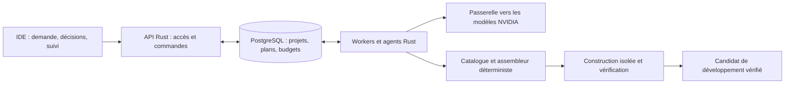

# Kyro

**Décrivez le logiciel dont vous avez besoin. Une équipe d’agents le construit, le fait évoluer et le maintient.**

Kyro est un IDE agentique conçu pour prendre en charge le cycle de vie d’une application web : comprendre une intention, préparer un plan, composer le logiciel, le vérifier, le publier et assurer sa maintenance. L’utilisateur garde la maîtrise des règles métier, du design et du budget ; le système conserve le contexte, les décisions et les preuves nécessaires pour poursuivre le travail.

L’ambition est **généraliste** : CRM, commerce, réservation, support, portails, outils internes, applications documentaires et workflows métier. Kyro s’adresse aux personnes et aux organisations qui veulent un logiciel utile dans la durée, ainsi qu’aux développeurs qui souhaitent examiner son code et ses changements.

> **État au 6 octobre 2026 : prototype en développement.** `main` réunit l’IDE desktop, le chat Nano, le socle durable P1, la fabrique P2, les agents P3 et leur raccordement au composeur. Des candidats de développement ont été vérifiés dans des recettes locales, dont des essais avec des modèles NVIDIA sur Nebius. Le canevas éditable, l’aperçu applicatif intégré, la publication et la maintenance continue font encore partie de la feuille de route. Les preuves historiques restent liées aux sources testées.

[Démarrer](#démarrer) · [Vision produit](#la-vision-produit) · [Architecture](#architecture) · [Avancement](#ce-qui-est-présent-aujourdhui) · [Documentation](docs/README.md)

## La vision produit

Un projet doit pouvoir commencer par une demande comme : « Crée un portail pour nos clients, avec leurs documents, des demandes de support, une facturation et des droits par équipe. » Kyro doit transformer cette demande en un logiciel exploitable, puis accompagner chaque changement de ses vérifications.

Le parcours cible couvre six étapes :

1. **Exprimer le besoin**, depuis un ordinateur ou un téléphone. Texte, voix, photos et captures sont les modes d’entrée envisagés.
2. **Construire un plan compréhensible** : usages, écrans, données, règles, composants disponibles, critères d’acceptation et budget. Une capacité manquante est signalée avant d’engager la construction.
3. **Assembler et essayer l’application** : les agents travaillent sur des tâches bornées, le système contrôle les contrats, et l’utilisateur consulte un aperçu.
4. **Modifier visuellement ou par conversation** : changer un texte dans le canevas, ajuster une interface ou faire évoluer une règle métier. Les choix du client doivent survivre aux reconstructions.
5. **Publier une version vérifiée**, puis suivre son fonctionnement, ses données et ses coûts.
6. **Maintenir et faire évoluer le logiciel** : reproduire un incident hors production, vérifier une correction, promouvoir la version autorisée et préserver les données existantes.

L’expérience cible réunit demande et décisions, canevas de l’application, activité des agents et état du service. Une vue avancée donne accès aux fichiers, différences, tests et journaux. Les sessions durables doivent permettre de reprendre un projet quand l’utilisateur ferme son appareil. Le produit vise un hébergement géré ou choisi par l’utilisateur, avec des modèles appelés par API cloud.

## Une bibliothèque de logiciels composables

**Les agents applicatifs sélectionnent, configurent et composent des blocs validés.** Une spécification versionnée décrit écrans, données, relations, permissions, événements et règles métier ; un assembleur déterministe transforme les déclarations prises en charge en logiciel.

Le catalogue cible comporte **180 blocs en 18 familles**. Ce nombre décrit la vision de conception, pas 180 fonctionnalités déjà livrées et qualifiées.

| Ensemble | Capacités visées |
| --- | --- |
| Identité et collaboration | Authentification, organisations, équipes, permissions et espaces partagés |
| Sécurité et données | Gouvernance, isolation, persistance, schémas et migrations |
| Logique et échanges | Règles métier, workflows, tâches, événements et intégrations |
| Interfaces | Navigation, formulaires, vues de données et tableaux de bord en Rust/Leptos |
| Contenu et intelligence | Fichiers, documents, recherche, connaissances et fonctions IA |
| Services métier | Communications, calendriers, réservation, commerce, opérations et rapports |
| Fabrique et exploitation | Adaptateurs, composition, construction, vérification, livraison et maintenance |

Si une capacité manque, l’agent déclare ce manque. L’enrichissement du catalogue suit un processus distinct de conception, revue, tests et admission. Chaque composant livré reste rattaché à sa version et à sa provenance. Les contrôles portent aussi sur les interactions entre blocs : permissions, transactions, concurrence, reprises et migrations.

## Une équipe d’agents, avec des contrats

L’orchestrateur décompose le besoin, sélectionne les composants et coordonne les dépendances. Les exécutants reçoivent des microtâches avec une entrée, un périmètre autorisé, une sortie structurée, une preuve attendue et des limites de temps, de tokens et de reprises. Revue et sécurité complètent le travail avant la fabrication d’un candidat.

P3 démarre avec **quatre exécutants : Pixel, Moka, Kiwi et Biscotte**, un orchestrateur et deux rôles de revue. La vision prévoit une équipe extensible et un agent de maintenance disposant d’une mémoire persistante. L’effectif et les modèles réellement utilisables dépendent du runtime configuré.

Les modèles NVIDIA sont sélectionnés dans un registre retenu par l’opérateur : modèle compatible le plus coûteux pour l’orchestrateur, le moins coûteux pour les exécutants et les revues, selon le profil tarifaire déclaré. Cette règle ne démontre aucun gain de coût ou de qualité. Les permissions, plafonds, états durables et conditions de publication restent imposés par le logiciel.

## Architecture

Le cœur est un **monolithe modulaire Rust**, avec des processus API et worker séparés, PostgreSQL pour l’état durable, et une passerelle serveur vers les modèles cloud. L’enveloppe de l’IDE utilise React, TypeScript et Electron. Les interfaces des applications assemblées sont prévues en Rust avec Leptos, distinctes de l’IDE.



Ce schéma décrit la chaîne backend présente. L’aperçu intégré, la promotion en production et la maintenance continue prolongeront cette chaîne.

| Répertoire | Responsabilité |
| --- | --- |
| [`apps/desktop`](apps/desktop) | Interface, fenêtre native, projets locaux, pont authentifié Chat/P3 |
| [`crates/kyro-domain`](crates/kyro-domain) | Contrats, états, spécifications et règles communes |
| [`crates/kyro-api`](crates/kyro-api) | API HTTP versionnée, identité et autorisations |
| [`crates/kyro-store`](crates/kyro-store) | PostgreSQL, migrations, file durable et audit |
| [`crates/kyro-gateway`](crates/kyro-gateway) | Registre, appels modèles et validation des réponses |
| [`crates/kyro-worker`](crates/kyro-worker) | Exécution des jobs, effets et comptabilité |
| [`crates/kyro-app`](crates/kyro-app) | Runtime applicatif et capacités métier |
| [`crates/kyro-factory`](crates/kyro-factory) | Catalogue, composition, construction et preuves |
| [`crates/kyro-agents`](crates/kyro-agents) | Plans, tâches bornées, coordination et reprise |

## Ce qui est présent aujourd’hui

| Tranche | Implémentation et preuves | Limites |
| --- | --- | --- |
| IDE desktop | Interface React/Electron, projets, explorateur, worktrees, thèmes et recettes frontend | Windows ; paquet non signé ; certaines commandes restent des éléments de maquette |
| Chat Nano | Pont local, streaming, contexte, arrêt, jobs et budget persistés ; essais réels locaux documentés | Runtime et politique de données à configurer ; l’historique visible disparaît au rechargement |
| P1 — Socle | Identité, droits, projets, révisions, idempotence, file durable, budgets, SSE et restauration | Recettes synthétiques distinguées des essais fournisseur ; aucune qualification générale de production |
| P2 — Fabrique | Runtime métier, catalogue fermé, assemblage déterministe, construction isolée et attestations | Les versions doivent être qualifiées et admises pour les sources effectivement utilisées |
| P3 — Agents | Plans persistés, quatre exécutants, revue/sécurité, reprise et candidats vérifiés ; composeur raccordé | Tests UI avec doublures ; runtime Chat seul sans équipe/fabrique P3 ; preuves NVIDIA historiques liées à leurs empreintes |

Les guides [frontend](apps/desktop/VALIDATION.md), [P1](docs/backend/partie-1/CONFORMITE.md), [P2](docs/backend/partie-2/VALIDATION.md), [P3](docs/backend/partie-3/VALIDATION.md) et [raccordement IDE](docs/backend/partie-3/IDE.md) précisent les environnements, essais, échecs et limites. Un plan `verified` est un candidat vérifié, pas un déploiement.

## Démarrer

### IDE desktop

Prérequis : **Windows x64, Node.js 22.12+ et npm**.

```powershell
git clone https://github.com/gus-rlin/Kyro.git
cd Kyro/apps/desktop
npm ci
npm run dev
```

Le lancement prépare un Git privé dont l’empreinte SHA-256 est contrôlée, puis ouvre Electron. Le premier import d’Electron télécharge son binaire. Pour l’aperçu navigateur sur le port loopback 5174 :

```powershell
npm run prepare:git
npm run dev:web
```

Un seul aperçu peut utiliser ce port. L’installation de l’IDE permet d’explorer l’interface ; les appels modèles et la fabrication nécessitent leur configuration backend. Voir le [guide desktop](apps/desktop/README.md).

### Backend et modèles

Le toolchain est épinglé dans [`rust-toolchain.toml`](rust-toolchain.toml). Les parcours d’intégration utilisent PostgreSQL ; les constructions protégées nécessitent leur environnement isolé. Aucun GPU local n’est requis pour les appels cloud.

1. Préparer la configuration à partir de [`.env.example`](.env.example), charger les variables dans le terminal et configurer les rôles PostgreSQL selon [P1 — Opérations](docs/backend/partie-1/OPERATIONS.md).
2. Exécuter les migrations avec le rôle admin, puis lancer l’API et le worker avec leurs rôles restreints, dans deux terminaux :

   ```powershell
   cargo run --locked -p kyro-api
   cargo run --locked -p kyro-worker
   ```

3. Pour les agents, configurer la fabrique, qualifier et admettre le catalogue, définir l’équipe et le registre de modèles, puis les droits, la politique de données et le budget du projet : [P2 — Opérations](docs/backend/partie-2/OPERATIONS.md), [P3 — Opérations](docs/backend/partie-3/OPERATIONS.md).
4. Suivre le [guide Chat Nano](docs/backend/chat-nano.md) pour son runtime local, ou le [parcours P3 dans le composeur](docs/backend/partie-3/IDE.md) pour planifier et exécuter une construction.

Les clés fournisseur restent côté serveur. La sélection d’un modèle dans l’interface ne configure pas le runtime ni ses permissions. Les jeux synthétiques et leurs identités de développement restent distincts des configurations de production.

Le [`Dockerfile`](Dockerfile) construit les binaires API, worker et migrateur dans une image non privilégiée. Les procédures d’installation, de qualification et de restauration sont documentées séparément ; aucun déploiement n’est lancé par la commande de build.

## Feuille de route

| Étape | Résultat recherché | État |
| --- | --- | --- |
| P1 — Socle durable | Enregistrer, autoriser et reprendre une commande | Implémenté, recettes locales documentées |
| P2 — Catalogue et fabrique | Transformer une spécification en candidat construit et vérifié | Implémenté, admission liée aux sources |
| P3 — Planification et agents | Transformer une demande en plan, puis en candidat vérifié | Implémenté ; raccordement IDE présent, parcours applicatif complet à poursuivre |
| P4 — Publication et évolution | Publier, observer et mettre à jour une version en préservant les données | Prévu |
| P5 — Maintenance et qualification | Diagnostiquer, corriger hors production, valider et promouvoir | Prévu |

Les autres axes produit couvrent la bibliothèque UI Leptos, l’aperçu et le canevas éditable, la mémoire structurée avec compaction, la continuité entre mobile et ordinateur et l’extension du catalogue. Le système doit à terme mesurer le coût total par résultat validé. Les objectifs de rapidité et les comparaisons Codex/Kyro restent à mesurer sur des conditions communes ; aucun gain n’est annoncé ici.

## Vérifier et contribuer

Depuis la racine, les premiers contrôles sans services externes sont :

```powershell
cargo fmt --all -- --check
cargo test --locked --workspace
node scripts/check-openapi.mjs
```

La suite Rust par défaut ignore explicitement certaines recettes qui nécessitent PostgreSQL ou une fabrique protégée. Leurs commandes et prérequis sont décrits dans les guides de validation ; une suite par défaut réussie ne les qualifie pas.

Depuis `apps/desktop` :

```powershell
npm run build
node --test tests/chat-service.test.cjs tests/plans-service.test.cjs
npm test
```

Les recettes Electron nécessitent une session graphique Windows ; certaines recettes Chat nécessitent un runtime synthétique isolé. Voir [CONTRIBUTING.md](CONTRIBUTING.md) pour le travail sur branches et les règles de livraison, et [l’index documentaire](docs/README.md) pour les contrats, opérations et preuves.

## Licence

Le workspace Rust déclare **Apache-2.0** ; son texte figure dans [LICENSE](LICENSE). Le package desktop est actuellement déclaré `UNLICENSED`. Les conditions des dépendances et assets desktop sont recensées dans [THIRD_PARTY_NOTICES.md](apps/desktop/THIRD_PARTY_NOTICES.md).
