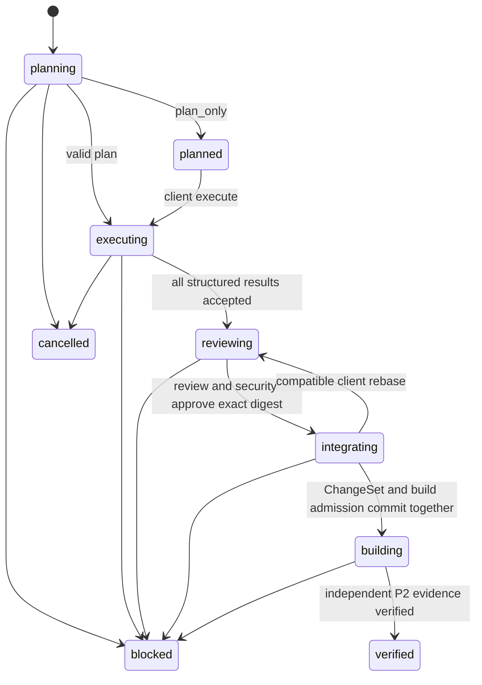

# P3 architecture

The API coordinates short transactions; P1 workers make outbound model calls.
No provider key is loaded by the API. Each transition locks the project before
its run. Multiple coordinators can cooperate without assigning a microtask
twice. Polling rotates up to 32 active runs through separate metadata; a waiting
poll does not create a logical version, event or history entry.

Every model result is bound to a P1 job, effect and registration snapshot. A
model assertion of success cannot create a factory artifact or promote a run
to `verified`. Reviews name the exact candidate digest; uncertainty or any
finding blocks integration. P2 then checks real evidence and release signatures,
job/source bindings and the project's current revision.

A `TaskContract` defines components, captured reads, permitted writes,
dependencies, retry bounds and invariants. Code derives capabilities and
protected criteria from signed admitted manifests. Shared component and business
invariants are added by the server. The initial family policy is deliberately
conservative; it serializes shared records, governance, identity, booking,
commerce and scarce capacity even across different node IDs. Conflicting tasks
must be transitively ordered. Missing components, unmet dependencies, cycles,
undeclared writes and changed component versions are refused.

An executor sees its scoped snapshot plus completed ancestors, not unrelated
concurrent results. Deterministic transformations use the same validation but
consume no model call. Integration applies the combined changes through P1,
then admits the signed P2 build in the same transaction. A transition savepoint
rolls back partial admissions before persisting a blockage.

An unrelated client edit can survive integration: every captured read/write
is compared with the current specification; the candidate is rebased and
reviewed again. A conflicting edit is preserved and produces
`client_edit_conflict`. New instructions cancel outstanding jobs, increment the
plan epoch and retain only completed results whose scopes and full contracts
remain compatible. Retention also requires unchanged ancestor contracts.

Memory distinguishes sourced facts, hypotheses, decisions and diagnostics.
Compaction is a deterministic checkpoint/index, not a model summary replacing
the source of truth. Complete history, calls and results stay durable. Contexts
load selected observations and reload authoritative grants, policy, budgets,
catalogue and run state. Checkpoints retain references, digests, remaining caps,
diagnostics and source/version information.

An emitted call whose response is lost becomes an unknown P1 effect; recovery
does not resend it automatically. An observed response can be financially
settled even when its job is cancelled. The cancelled job cannot feed a new
epoch. Revocation closes an active run through a narrowly scoped API-only SQL
helper; it does not replay calls, fabricate usage or release uncertain holds.

Migrations `0020`–`0023` add forced-RLS run/history storage, revocation closeout,
fair polling and restricted agent metadata events. The API-only event helper
requires fresh read and execute authority and derives its payload from the
persisted actor/environment/version; planning and compaction do not require
write authority. Integration retains P1's separate write fence. Reads within a
locked transition use that transaction's connection, including build evidence;
the coordinator works with a single-connection pool. Historical snapshots cannot
be updated or deleted by runtime
roles. The one-active-run constraint is scoped to project and environment;
read-only planned proposals are inactive until explicitly executed.
