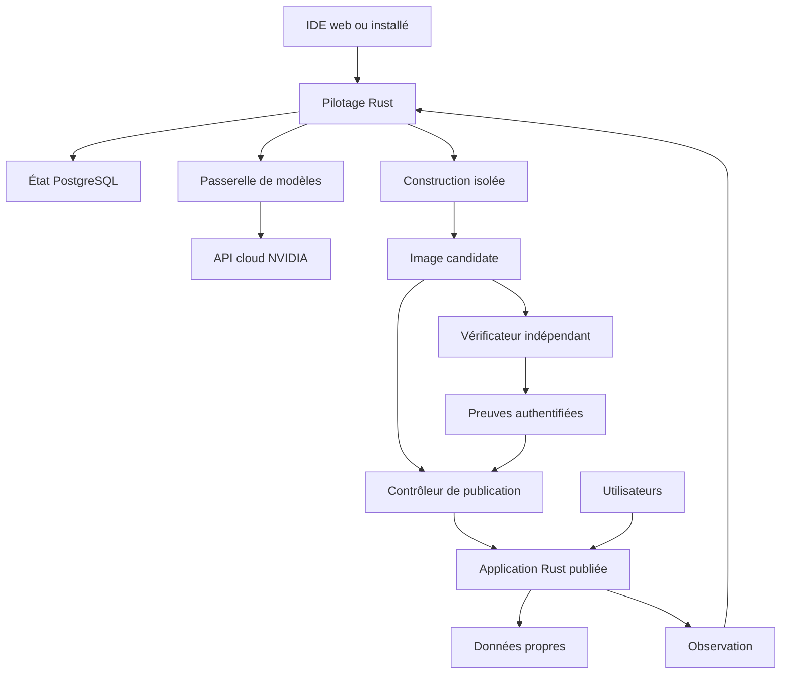

**Architecture cible modulaire, hébergeable dans le cloud et connectée aux modèles NVIDIA par API.** Le pilotage, l’assembleur et tous les blocs applicatifs que nous construirons sont écrits en **Rust**, avec PostgreSQL pour l’état durable. Les interfaces des applications assemblées utilisent des blocs Rust avec Leptos, rendu HTML côté serveur et WebAssembly pour les interactions. L’enveloppe de l’IDE conserve React et TypeScript. La performance et la sécurité sont des exigences à vérifier sur la chaîne complète.

Cette architecture met en œuvre la [description du produit](https://chatgpt.com/space/page_c41a658d84b08191b0295f1f1cb36e2d) : catalogue obligatoire, orchestrateur NVIDIA coûteux, quatre exécutants NVIDIA peu coûteux au départ, revue, sécurité, canevas, mémoire et maintenance. **C’est une cible à construire, pas un inventaire de fonctions disponibles.** La contrainte d’exécution entièrement locale est retirée. Un IDE installable et un hébergement choisi restent possibles, sans imposer de télécharger les modèles ni de posséder un GPU.

Révision du **2 octobre 2026**. Les choix ci-dessous sont nos décisions de conception ; les références officielles établissent des capacités et leurs limites. Les versions exactes, performances, budgets et preuves de sécurité seront figés ou mesurés lors de l’implémentation.

Les choix précisés lors de la revue sont expliqués dans [Décisions de conception et justification des améliorations](https://chatgpt.com/space/page_baca1e1d35e481919683b0dc23455045).

## Déploiement cloud et installation personnelle

Le produit accepte un hébergement géré, un serveur choisi par l’utilisateur ou un poste de développement. **L’inférence NVIDIA passe par une API cloud dans le périmètre retenu pour le hackathon.** Installer l’IDE ne signifie pas exécuter les modèles chez soi. Le modèle, l’opérateur de l’endpoint et la région sont trois choix distincts ; leur admissibilité doit être vérifiée dans le règlement applicable.

| Élément | Placement prévu | Règle de traitement |
| --- | --- | --- |
| IDE et aperçu | Navigateur ou installation personnelle | Aucun accès implicite au disque, au presse-papiers ou aux comptes |
| Pilotage et workers | Cloud de référence ; serveur personnel possible | Identités, politique de projet et état durable |
| Modèles NVIDIA | API d’un fournisseur autorisé | Clé côté serveur et contexte minimal approuvé |
| Données des applications | Hébergement choisi pour chaque application | Cloisonnement, chiffrement et rétention définis |
| Observation et maintenance | Hébergement continu pour le service continu | Diagnostics minimisés et droits distincts de la production |

L’utilisateur fournit nécessairement une demande et les connexions qu’il choisit de configurer. Le système n’aspire pas silencieusement les informations de son poste et ne donne pas aux agents un accès général aux données des utilisateurs finaux. Les appels externes sont déclarés par destination, finalité et catégorie de données. Notre architecture ne promet donc ni un fonctionnement hors ligne complet ni une absence de transmission au fournisseur d’inférence. Sources : [API NVIDIA](https://docs.api.nvidia.com/nim/docs/introduction), [authentification API Nebius](https://docs.tokenfactory.nebius.com/quickstart).

## Les décisions techniques structurantes

1. **Un monolithe modulaire en Rust.** Les modules possèdent leurs règles, leurs interfaces et leurs écritures. Des crates séparées rendent les dépendances explicites ; le graphe doit rester acyclique. API et worker sont des exécutables distincts issus du même workspace Cargo. Un bloc ne devient pas automatiquement un microservice. Le catalogue et les vérificateurs suivent un cycle de publication protégé, distinct des applications assemblées.

2. **Des frontières de confiance imposées.** Pilotage, passerelle de modèles, construction, vérification et publication ont des identités et des capacités distinctes. Les applications publiées possèdent leurs données et secrets. Un appel de modèle ne peut ni élargir ces droits ni autoriser une promotion.

3. **Une spécification commune.** La conversation, le canevas et les agents modifient la même représentation versionnée de l’application. Le code applicatif est produit par un assembleur déterministe à partir du catalogue.

4. **Des modèles cloud sollicités à la demande.** La passerelle serveur détient la clé API, réduit le contexte envoyé et applique délais, budgets, destinations autorisées et contrôle des réponses. Les files, états, permissions et reprises restent pilotés par le logiciel déterministe.

5. **Une stack unique pour les applications générées.** Rust, Axum, Leptos et PostgreSQL constituent la cible du catalogue. Codex construit la même famille d’application avec cette même stack lors du comparatif. React et TypeScript appartiennent à l’enveloppe de l’IDE et à certains outils de test ; ils ne servent pas à réimplémenter les blocs métier du catalogue.

L’inférence, les compilations, les reprises, le stockage et l’entretien du catalogue sont mesurés séparément. **Rust est une contrainte de construction et un levier d’efficacité, pas une preuve d’ultraperformance.** Nous cherchons des gains de latence, mémoire et coût par résultat validé, sans les annoncer avant mesure.

## La stack retenue

| Couche | Choix de référence | Responsabilité |
| --- | --- | --- |
| Enveloppe de l’IDE | React et TypeScript strict | Conversation, plan, activité, éditeur et pilotage du canevas |
| Interface des applications | Blocs Rust avec Leptos | HTML sémantique, rendu serveur, hydratation WebAssembly et thèmes |
| API et cœur métier | Rust, Axum, Tokio et Tower | Commandes typées, autorisations, transactions et limites |
| Assemblage | Compilateur AppSpec en Rust | Validation sémantique et génération depuis des modèles approuvés |
| Données | PostgreSQL et SQLx | Requêtes paramétrées, transactions, pools bornés et migrations |
| Tâches durables | Worker Rust, file PostgreSQL et outbox | Baux, générations, reprises et déduplication |
| Catalogue et mémoire | PostgreSQL, JSONB et pgvector | Recherche, révisions, faits et décisions sourcées |
| Inférence cloud | Passerelle et adaptateurs HTTP en Rust | Modèles NVIDIA, budgets, contexte minimal et erreurs fournisseur |
| Identité | Intégration OpenID Connect et sessions côté serveur | Fédération, MFA via fournisseur et révocation des sessions |
| Construction et essais | Environnements Linux isolés | Cargo, outillage web et navigateur de test sous quotas |
| Livraison | Git, images OCI, registre privé et contrôleur Rust | Promotion de l’image effectivement vérifiée |
| Objets et sauvegardes | Adaptateurs Rust vers stockage compatible S3 | Objets privés, rétention, chiffrement et récupération |
| Vérification | Tests Rust, tests de propriétés, fuzzing ciblé et Playwright | Invariants, concurrence, intégration et parcours accessibles |
| Observation | Instrumentation Rust et OpenTelemetry | Traces expurgées, métriques bornées et incidents |

**Versions et dépendances.** Épingler la toolchain Rust, les dépendances via Cargo.lock, les images par empreinte et l’outillage web par fichiers de verrouillage. Construire avec le verrouillage imposé, inventaire des dépendances et revue des mises à jour. N’activer que les fonctionnalités nécessaires des crates ; les dépendances de compilation, macros procédurales et scripts de build passent aussi par la revue. Le workspace partage les conventions, sans transformer toutes les crates en une bibliothèque universelle. Source : [workspaces Cargo](https://doc.rust-lang.org/cargo/reference/workspaces.html).

Axum fournit la couche HTTP et s’appuie sur l’écosystème Tower ; Tokio porte l’asynchronisme et SQLx les accès SQL. Les contrôles métier et d’autorisation restent explicites dans nos services. Éviter les opérations CPU bloquantes dans la boucle asynchrone : utiliser un pool borné ou un worker dédié. Les transactions SQL restent courtes et n’attendent jamais un appel de modèle. Sources : [Axum](https://docs.rs/axum/latest/axum/), [Tokio](https://tokio.rs/tokio/tutorial), [SQLx](https://docs.rs/sqlx/latest/sqlx/).

**Deux interfaces, deux responsabilités.** L’IDE React pilote le projet et affiche l’application dans un aperçu isolé. Les blocs d’interface des applications sont écrits en Rust avec Leptos ; ils produisent du HTML et, lorsque nécessaire, du WebAssembly avec la liaison navigateur fournie par l’outillage. CSS, schémas et migrations SQL restent des ressources déclaratives. Aucun secret ni contrôle d’autorisation décisif n’est embarqué côté navigateur. Le rendu serveur doit filtrer les données avant toute sérialisation dans le HTML ou l’état d’hydratation. Une tranche formulaire, liste et session valide ce choix avant d’étendre la bibliothèque. Source : [guide Leptos](https://book.leptos.dev/).

## La règle Rust pour tous les blocs

**Chaque bloc que nous construisons doit être implémenté en Rust et sécurisé par défaut**, y compris les règles métier, connecteurs, traitements, composants d’interface et modules de la fabrique. Le cœur serveur et l’assembleur adoptent également Rust pour partager les contrats et supprimer le socle C# initial. Un habillage Rust autour d’une implémentation métier écrite dans un autre langage ne satisfait pas cette règle.

Le système de possession de Rust permet des garanties de sécurité mémoire sans ramasse-miettes. Il ne garantit ni l’autorisation correcte d’une action, ni la validité d’une transaction, ni une latence donnée. Nos crates métier interdisent le code unsafe ; une exception de bas niveau doit être isolée, justifiée, revue et testée. Cette interdiction dans notre code n’élimine pas le code unsafe des dépendances, qui restent inventoriées et évaluées. Sources : [possession en Rust](https://doc.rust-lang.org/book/ch04-00-understanding-ownership.html), [limites et encapsulation du code unsafe](https://doc.rust-lang.org/book/ch20-01-unsafe-rust.html).

| Élément | Règle | Frontière |
| --- | --- | --- |
| Blocs métier, sécurité et connecteurs | Implémentation Rust | Contrats et autorisations côté serveur |
| Blocs d’interface | Rust et Leptos | Aucune confiance dans une validation navigateur |
| Modules du pilotage et assembleur | Rust | Crates séparées, dépendances contrôlées |
| Enveloppe de l’IDE | React et TypeScript conservés | Commandes via API, sans logique métier dupliquée |
| Services tiers et outils | Réutiliser des projets maintenus | Adaptateurs Rust, versions et capacités explicites |
| Extensions non fiables | Aucun chargement natif arbitraire | Processus isolé ; Wasm serveur seulement après qualification |

Nous ne réécrivons pas PostgreSQL, le navigateur, la cryptographie ou le runtime de sandbox. La règle Rust porte sur les blocs que nous développons ; leurs services externes sont déclarés. Les blocs approuvés sont liés à la compilation selon le manifeste. Aucun plugin natif téléchargé ne reçoit les droits du processus hôte ; une crate est une frontière de modularité, pas une sandbox.

## Contrats entre modules

| Module | Autorité propre | Interface offerte |
| --- | --- | --- |
| Identité et politique | Acteurs, sessions et capacités | Décision d’accès vérifiable et contexte de projet |
| Projets et révisions | AppSpec accepté et préférences | Commandes conditionnées par une révision |
| Catalogue et compilateur | Versions approuvées et résolution | Manifeste verrouillé, diagnostic de compatibilité et sources |
| Plans et ordonnanceur | Tâches, baux et générations | Réservation, transition et annulation |
| Passerelle de modèles | Destinations, contextes et réservations d’appels | Proposition structurée et consommation observée |
| Exécution | Sandboxes et ressources temporaires | Construction ou essai borné et résultat référencé |
| Preuves et livraison | Validations et état du déploiement | Promotion conditionnelle et observation du résultat |
| Mémoire et incidents | Faits sourcés et suivi des incidents | Recherche cloisonnée et point de reprise |
| Consommation et audit | Budgets et journal d’actions | Admission atomique, rapprochement et export autorisé |

Les types métier ne dépendent ni d’Axum ni de SQLx. Les services applicatifs portent les transactions et utilisent des interfaces Rust explicites ; les adaptateurs réalisent SQL, HTTP, stockage et système. Aucun module n’écrit directement dans les tables possédées par un autre. Une interaction atomique passe par un service de composition et une transaction définie ; au-delà d’un processus, les contrats et événements sont versionnés.

Les règles de dépendance sont vérifiées en CI. Chaque module fournit erreurs stables, politique d’annulation, délais et limites de ressources. Les échanges interprocessus utilisent HTTP ou événements documentés ; aucun ABI Rust dynamique n’est supposé stable. Extraire un service exige une raison mesurée de charge, de disponibilité ou de confiance.

## Architecture et frontières de confiance

L’architecture sépare **pilotage, exécution des constructions et exploitation des applications**. Une passerelle contrôle les échanges d’inférence cloud. Les frontières de droits et de réseau demeurent effectives en installation personnelle comme en hébergement géré. Le constructeur ne publie pas lui-même ses artefacts.



Le navigateur dialogue avec l’API sous la même origine. Les événements de progression passent par **Server-Sent Events**, avec séquence persistante par projet et reprise par `Last-Event-ID`. Après expiration de l’historique disponible, le client recharge un état complet puis reprend le flux. L’API vérifie l’accès au projet à chaque connexion ; les clients lents ne font pas croître une file mémoire sans limite. HTTP transporte les commandes, protégées contre les doublons ; WebSocket reste réservé au terminal interactif et aux besoins futurs de collaboration. Source : [standard HTML sur les événements serveur](https://html.spec.whatwg.org/multipage/server-sent-events.html).

Le pilotage ne compile aucun projet dans son processus et les sandboxes ne détiennent aucun accès d’administration à la production. Un contrôleur de publication doté de droits propres vérifie les preuves avant toute promotion. **Les parcours métier ordinaires d’une application publiée ne dépendent ni du pilotage ni d’un modèle.** L’application conserve son runtime, ses données, ses sessions et ses paramètres ; un fournisseur d’identité externe reste une dépendance explicitement déclarée. Seules les fonctionnalités IA choisies pour cette application dépendent de l’inférence, avec indisponibilité et dégradation prévues. Une panne de l’API NVIDIA suspend les travaux agentiques et ces fonctionnalités IA, sans suspendre une réservation ordinaire.

## La spécification et le catalogue

**PostgreSQL est la référence des révisions AppSpec, des décisions, des plans et des pointeurs de version.** AppSpec décrit données, écrans, règles, rôles, workflows et préférences visuelles. Une révision immuable est acceptée avec sa version de départ, puis l’outbox déclenche génération et export Git. Git est la trace versionnée des sources produites et un format d’export ; il ne constitue pas un second état métier à modifier en parallèle. Une panne d’export laisse un travail à reprendre et bloque la livraison qui exige ce commit. Une modification externe du code est détectée et ne peut être silencieusement écrasée ou intégrée au circuit du catalogue.

| Objet | Contenu obligatoire |
| --- | --- |
| AppSpec | Schéma versionné, révision immuable, données, droits, écrans, règles et identifiants stables |
| ComponentManifest | Identité, version, empreinte, licence, contrats, dépendances, cibles, capacités, données traitées, migrations et tests |
| TaskContract | Objectif et révision, propriétaire, instantané AppSpec, lectures et écritures sémantiques, dépendances, capacités, critères d’acceptation, délais et budget |
| ChangeSet | Opérations typées, versions effectivement lues, éléments modifiés, préconditions, provenance, effets et preuves référencées |
| EffectIntent | Identité durable, cible, paramètres, génération, statut et résultat externe |
| DataPolicy | Catégories de données, finalités, destinataires, rétention et interdictions |
| CapabilityGrant | Acteur, projet, action, ressources, environnement, durée et limites accordées |
| ReleaseManifest | AppSpec, assembleur, catalogue, dépendances, commit, image, configuration et migrations |
| EvidenceBundle | Empreinte de l’artefact, contrôles, identité du vérificateur et résultats authentifiés |
| Deployment | Environnement, génération, version attendue, souhaitée, observée et étape |

Les schémas utilisent **JSON Schema 2020-12**. Les agents reçoivent un sous-ensemble compatible avec le fournisseur ; le serveur applique ensuite la validation complète et les invariants métier. Un JSON bien formé n’établit ni la faisabilité ni l’autorisation d’une action. Source : [spécification JSON Schema](https://json-schema.org/draft/2020-12).

L’assembleur Rust traite AppSpec comme un langage restreint. Il valide structure, références, types, permissions, flux de données, effets, dépendances et invariants avant d’instancier les modèles. Il calcule les capacités nécessaires et refuse celles que la politique du projet n’accorde pas. Les cycles sont refusés sauf dans un workflow explicitement pris en charge et borné. Aucun champ ne devient une expression JavaScript, Rust, SQL ou shell libre. Chaque fichier reste rattaché à une version du catalogue ; les tests d’intégration vérifient les propriétés que cette analyse statique ne démontre pas.

Le catalogue couvre les fonctions transversales, les domaines métier et la fabrique elle-même. Son inventaire détaillé est maintenu dans la sous-page de catalogue liée ci-dessous. Une capacité absente bloque la tâche concernée ; elle passe par un circuit séparé de conception, revue, tests et publication. Un bloc disponible individuellement ne rend pas toute combinaison valide. Voir le [catalogue de 180 blocs Rust](https://chatgpt.com/space/page_a34ccccf45d88191a9cf39578c465f43), avec 18 familles, invariants et recettes métier.

La recherche combine filtres exacts de compatibilité, recherche textuelle et similarité vectorielle dans PostgreSQL. Les embeddings des fiches sont calculés une fois par version, puis réutilisés. Le modèle d’embedding et sa version sont enregistrés ; changer de modèle exige de réindexer. Pour un petit catalogue, commencer par une recherche vectorielle exacte ; introduire un index approximatif après mesure du temps de réponse et du rappel. Source : [pgvector](https://github.com/pgvector/pgvector).

La similarité propose des candidats ; les contrats décident de leur compatibilité. Les sources générées doivent être reproductibles à partir d’AppSpec normalisé, des empreintes du catalogue, de l’assembleur et des dépendances verrouillées. Nous retenons une canonicalisation JSON compatible avec la [RFC 8785](https://www.rfc-editor.org/rfc/rfc8785.html), avec identifiants et valeurs décimales exactes encodés selon le schéma. Cette RFC est informative. La reproductibilité des sources ne prouve pas celle de toute image binaire : la livraison référence toujours l’image effectivement construite et testée par son empreinte.

## Admission et évolution des blocs

Un bloc est une capacité versionnée du catalogue, livrée comme une ou plusieurs crates et ressources déclaratives. Sa fiche précise : propriétaire, API, types, invariants, erreurs, dépendances, cibles serveur ou navigateur, permissions, données traitées, effets externes, limites, stratégie de reprise, migrations et preuves. Une recette métier compose ces blocs sans contourner leurs contrats.

Chaque application reçoit un fichier de verrouillage de composition et une nomenclature des dépendances. Les versions d’API, d’événements et de données évoluent explicitement. Une mise à jour du catalogue ne modifie jamais silencieusement une application publiée ; elle produit un changement soumis à validation. Les workflows en cours gardent une version compatible ou suivent une migration testée.

Cycle de vie : **à construire → expérimental → validé → déprécié → retiré ou révoqué**. Seuls les blocs validés sont disponibles aux agents applicatifs. Un bloc révoqué bloque les nouvelles constructions ; l’inventaire identifie les versions déployées touchées et ouvre une procédure de correction. La réponse d’urgence n’éteint pas aveuglément toutes les applications.

Avant admission, exiger revue humaine, modèle de menace proportionné, tests de contrat, cas d’accès refusés, invariants transactionnels, scénarios de panne, budget de performance et documentation. Les tests de propriétés et le fuzzing ciblent les parsers, permissions et machines d’états ; une composition reçoit aussi ses propres tests. La bonne sécurité d’un bloc isolé ne prouve pas celle de l’assemblage.

## Orchestration durable et modèles NVIDIA

L’orchestrateur propose un plan et des attributions. **L’ordonnanceur déterministe reste propriétaire du graphe de dépendances, des transitions et des budgets.** Le pool initial comprend quatre exécutants ; chacun reçoit au plus une microtâche active, lorsque ses dépendances sont satisfaites. Le nombre d’exécutants actifs dépend du travail indépendant disponible et des quotas, puis peut évoluer dans la politique du projet. Une tâche calculable n’appelle pas de modèle ; une décomposition supplémentaire doit apporter un critère vérifiable ou une indépendance utile.

| Rôle | Affectation conservée | Exécution proposée |
| --- | --- | --- |
| Orchestration | Modèle NVIDIA le plus coûteux du catalogue retenu | Décisions bornées et arbitrages |
| Exécutants | Modèle NVIDIA peu coûteux | Petites modifications structurées de la spécification |
| Revue et sécurité | Modèle peu coûteux avec escalade | Contextes séparés et vérifications complémentaires |
| Maintenance | Même modèle que l’orchestrateur | Appel sur incident qualifié |
| Recherche sémantique | Modèle d’embedding versionné | Indexation et recherche des composants |

**Fournisseur candidat : Nebius Token Factory**, derrière un adaptateur remplaçable. Sa documentation expose les [appels d’outils](https://docs.tokenfactory.nebius.com/ai-models-inference/function-calling) et les [sorties structurées](https://docs.tokenfactory.nebius.com/ai-models-inference/json). Leur prise en charge doit être vérifiée pour chaque modèle et endpoint.

Le [cookbook officiel Nebius](https://dev.nebius.com/cookbook/agent-cost-benchmark) utilise notamment Nemotron 3 Ultra, Nemotron 3 Super et Nemotron 3.5 Lightning. Ultra et Lightning constituent des candidats à tester pour les deux niveaux de coût ; ce petit benchmark ne prouve pas leur supériorité pour notre application et ne remplace pas une grille tarifaire actuelle.

Avant la première campagne, figer un registre avec fournisseur, identifiant exact, version exposée, capacités, région, tarifs entrée et sortie, limites et date. Pour déterminer « le plus coûteux », comparer les modèles compatibles avec un même profil de tokens fixé à l’avance. Si le fournisseur ne permet pas d’épingler les poids, documenter cette limite de reproductibilité.

Un worker est un processus logiciel, distinct du modèle qui propose les actions. Chaque tâche part d’un instantané identifié et produit un ChangeSet sur AppSpec ; l’assembleur produit le code. Le serveur calcule les ensembles de lecture et d’écriture à partir des opérations et du catalogue : les déclarations du modèle ne font pas autorité. Les conflits portent sur les objets, règles, schémas et invariants partagés, même lorsque les fichiers diffèrent. Les écritures concurrentes incompatibles sont ordonnées ; l’intégration compare les versions lues et revalide les dépendances. Si leur indépendance ne peut être établie, les tâches restent séquentielles.

La file PostgreSQL persiste états, échéances, baux et tentatives. Une transaction courte réserve une tâche avec `SKIP LOCKED`, puis libère ses verrous avant tout appel externe. Chaque nouvelle tentative reçoit une génération croissante ; l’enregistrement de son résultat compare cette génération et l’état attendu. Un ancien worker peut encore tourner, mais ses écritures devenues obsolètes sont refusées. Les transitions et leurs préconditions sont centralisées et testées ; les tâches durablement en échec sortent de la file active avec un diagnostic. Source : [verrouillage PostgreSQL](https://www.postgresql.org/docs/18/sql-select.html).

Chaque effet externe commence par une intention durable `EffectIntent`. L’outbox enregistre état et événement dans la même transaction ; les consommateurs dédupliquent la livraison au moins une fois. La clé d’idempotence lie projet, action et paramètres : réutiliser la même clé avec des paramètres différents est refusé. Après un délai dépassé ou un accusé perdu, l’effet passe en **résultat inconnu** jusqu’au rapprochement avec le service externe. La génération protège nos écritures ; elle n’annule pas une requête déjà envoyée. Si le connecteur n’offre ni idempotence ni moyen fiable de vérifier l’effet, cette action ne peut pas être rejouée automatiquement. Source : [AWS sur les API idempotentes](https://aws.amazon.com/builders-library/making-retries-safe-with-idempotent-APIs/).

L’admission réserve atomiquement un budget avant chaque appel concurrent, dans une devise et avec un tarif versionnés. La réserve couvre la borne de consommation autorisée ; le rapprochement utilise ensuite la facture ou les unités exposées. Après une réponse perdue, la réserve reste immobilisée jusqu’à résolution. Un arrêt interdit les nouvelles actions mais peut laisser une requête déjà partie facturable. Les plafonds de tokens, durée, tentatives et dépenses s’appliquent par tâche, projet et période ; un connecteur dont le coût ne peut être borné exige une politique spécifique avant activation.

Le lancement conserve une file durable PostgreSQL et des limites distinctes pour appels LLM, compilations, navigateurs et aperçus. Une rotation entre projets et une part de capacité réservée aux incidents évitent qu’un seul projet monopolise le service. Les reprises sont décidées à un seul niveau, avec délai progressif, aléa et nombre maximal ; une panne fournisseur ouvre un coupe-circuit. Un retour en service réintroduit progressivement les tâches. Un moteur de workflows ou un broker supplémentaire ne sera introduit qu’en réponse à une limite mesurée de reprise, de charge ou de maintenance. Source : [AWS sur la limitation des reprises](https://docs.aws.amazon.com/wellarchitected/latest/framework/rel_mitigate_interaction_failure_limit_retries.html).

### Contrats de délégation et résultats vérifiables

Le TaskContract lie une tâche à une demande révisable, un instantané d’application, un propriétaire et des critères protégés. Une délégation précise les ressources lisibles, les changements permis, les dépendances et les cas de blocage. Les exécutants proposent des tâches supplémentaires à l’ordonnanceur ; ils ne créent pas une récursion d’agents hors budget. Les rôles et modèles restent ceux du tableau ci-dessus.

| Échange | Contenu obligatoire | Contrôle logiciel |
| --- | --- | --- |
| Délégation | Identifiants tâche et parent, révision d’objectif, entrées, périmètre, critères et budget | Contrat complet, droits et dépendances valides |
| Résultat | ChangeSet, références de preuves, hypothèses, limites et erreurs observées | Schéma, versions, empreintes et périmètre contrôlés |
| Blocage | Cause précise, information ou capacité manquante, dernière tentative | Pas de succès implicite ni de nouveau code improvisé |
| Revue | Critères examinés, défauts et références aux observations | Analyse séparée du constructeur ; tests requis conservés |
| Reprise | Diagnostic, modification de stratégie et budget restant | Nouvelle tentative justifiée et bornée |

Les messages transmettent les changements utiles et les références aux artefacts, avec une taille maximale ; le destinataire peut relire la preuve dans son périmètre. La revue et la sécurité examinent d’abord contrat, changement et observations sans adopter le verdict du constructeur. Seul le logiciel passe une tâche à validée après les contrôles requis. Une majorité d’agents d’accord, une capture ou une compilation réussie ne remplace pas les critères métier.

**Arrêt des boucles.** Une erreur répétée sans changement pertinent d’entrée, d’outil ou de stratégie suspend la tâche avant épuisement mécanique du budget. L’orchestrateur peut préciser le contrat, choisir une autre opération autorisée, réattribuer ou signaler un blocage. Un désaccord est arbitré sur les preuves et le contrat ; il ne déclenche pas un débat sans limite. Les effets externes au résultat inconnu suivent toujours leur rapprochement dédié.

**Changement de demande et annulation.** Une retouche du canevas, une instruction ou une révocation crée une nouvelle révision de l’objectif ou de la politique. Le serveur ferme l’admission des tâches affectées, invalide leurs résultats devenus incompatibles et replanifie les dépendances concernées. Les travaux encore valides sont conservés. Avant un effet externe, vérifier à nouveau droits et révision ; après un arrêt, suivre les appels déjà admis jusqu’à un résultat confirmé ou inconnu. L’interface distingue arrêt demandé, nouvelles actions bloquées et effets encore en cours. Annuler n’efface pas un effet déjà engagé.

**Qualification et mesure.** Pour chaque couple rôle–modèle–endpoint, tester sur des cas distincts du benchmark final les formats, outils autorisés, refus attendus et capacité à signaler un manque. Fixer les affectations de la campagne avant les essais. Le [journal D20–D23](https://chatgpt.com/space/page_baca1e1d35e481919683b0dc23455045) relie ces adaptations aux études récentes et expose leurs limites ; elles ne constituent pas un gain déjà démontré.

## Données métier et mémoire persistante

La plateforme conserve organisations, projets, révisions, plans, tâches, intentions d’effets, preuves, déploiements, incidents et consommations. Les écritures nécessaires à une reprise sont transactionnelles. Les sources Git et objets volumineux sont rattachés à leurs empreintes depuis cet état ; leur production passe par des opérations rejouables. L’état courant fait autorité, complété par un journal de décisions : aucun event sourcing intégral n’est requis au lancement.

**Séparer les données de pilotage et celles des applications.** Les premières applications disposent chacune d’une base et d’un rôle PostgreSQL propres, avec identifiants distincts entre aperçu et production. Plusieurs bases peuvent partager un serveur ; CPU, connexions et pannes restent alors partagés. Chaque pool SQLx impose un maximum de connexions, une attente maximale et des délais de requête ; une réserve reste disponible pour l’administration. Les droits d’établissement sont vérifiés dans chaque application. Le pool ne porte jamais un contexte de locataire persistant entre deux requêtes. Source : [SQLx](https://docs.rs/sqlx/latest/sqlx/).

Dans les tables partagées, chaque accès porte un contexte d’organisation établi côté serveur. Les contraintes et clés étrangères incluent ce contexte quand nécessaire. Les politiques PostgreSQL de sécurité par ligne complètent les contrôles de l’API. Le rôle courant n’est ni propriétaire, ni superutilisateur, ni doté de `BYPASSRLS` ; migrations et exploitation utilisent des rôles distincts. Établir le contexte de manière locale à la transaction depuis l’identité vérifiée, sans faire confiance au seul identifiant envoyé par le client ; tester aussi la réutilisation des connexions et les accès croisés. Source : [Row Security Policies](https://www.postgresql.org/docs/18/ddl-rowsecurity.html).

La réservation de la dernière place s’effectue dans une transaction avec une opération conditionnelle atomique sur la capacité, puis l’insertion de la réservation et de son événement. Une contrainte d’unicité déduplique la demande. Deux requêtes concurrentes doivent produire un seul succès. Les workflows plus complexes utilisent le verrouillage ou l’isolation appropriée, avec reprise de la transaction complète en cas de conflit. Source : [isolation transactionnelle PostgreSQL](https://www.postgresql.org/docs/18/transaction-iso.html).

Les disponibilités conservent le fuseau IANA de l’établissement ; les instants sont enregistrés sans ambiguïté. Tester changements d’heure, annulations concurrentes et changements de règles sur réservations existantes.

La mémoire distingue décisions acceptées, faits observés et hypothèses. Chaque élément porte sa source, sa date, sa version et son périmètre. Le contexte d’une tâche contient son contrat, les seules fiches utiles et des références vers les preuves nécessaires ; il ne copie pas tous les historiques des autres agents. Un résumé signale explicitement les informations manquantes. L’index sémantique aide à retrouver les éléments ; révisions, budgets et droits sont rechargés depuis les données de référence.

La compaction écrit un point de reprise structuré pour chaque rôle. Le résumé peut être produit par un modèle, mais ses champs critiques sont vérifiés contre l’état persistant. Les interdictions, droits et limites sont réinjectés depuis la configuration autoritative. Les journaux complets restent consultables selon leur durée de conservation ; les secrets n’entrent pas dans les prompts ni dans les index.

## Canevas et aperçu

Le canevas ne modifie pas arbitrairement le DOM ou les fichiers produits. Chaque élément possède un identifiant stable relié à AppSpec. Un changement de couleur ou de texte devient une opération typée, avec validation locale, prévisualisation optimiste et enregistrement contrôlé. L’annulation ajoute une révision inverse.

Les écritures du canevas utilisent un ETag fort et `If-Match` : une révision périmée est refusée avec une réponse 412. Le système recharge la version courante et compare base, proposition et changements récents. Il réapplique automatiquement les opérations sur des propriétés indépendantes, puis revalide leurs dépendances ; une incompatibilité réelle reste explicite. Les identifiants de composants sont stables entre générations. Une réparation part de la version publiée, sans embarquer le brouillon, puis ses changements sont réconciliés avec celui-ci. Source : [conditions HTTP de la RFC 9110](https://www.rfc-editor.org/rfc/rfc9110.html#section-13.1.1).

Chaque aperçu dispose d’une origine propre sur un domaine distinct du pilotage, de données de test et de connecteurs sans effets réels. L’iframe expose seulement les capacités nécessaires ; les cookies du pilotage restent attachés à leur hôte. Le protocole de modification vérifie `origin`, `source`, type de message, révision et session ; il ne transporte ni secret ni commande arbitraire. Un identifiant de session sert à corréler le message, sans remplacer le contrôle d’accès serveur. Une sélection visuelle ne donne aucun droit de publication. Source : [sécurité de la communication entre fenêtres](https://html.spec.whatwg.org/multipage/web-messaging.html#security).

Le mode plan reste obligatoire : un changement visuel simple génère un petit plan déterministe validé automatiquement. Un changement de règles ou de droits rejoint le circuit de construction. « Enregistré » correspond au brouillon persistant ; « publié » correspond à un artefact promu.

Objectifs initiaux à mesurer : retour visuel local inférieur à 100 ms au 95e percentile après chargement ; création complète visée en quinze minutes sur le périmètre du prototype. Ces cibles reprennent la page produit et ne constituent pas des performances établies.

## Isolation et sécurité

**Traiter le code construit, les paquets installés, les données et les contenus récupérés comme des entrées non fiables.** La réutilisation d’un catalogue réduit le périmètre ; elle ne supprime pas les risques de dépendance compromise, d’injection ou de configuration incorrecte.

La construction et la vérification utilisent des sandboxes distinctes et éphémères, sur une machine séparée du pilotage et de la production. Les quotas CPU, mémoire, disque, processus, durée et réseau sont imposés par l’hôte. Aucun socket Docker hôte, secret de production ou clé de signature n’est monté. Les caches privés restent isolés par projet ; les dépendances communes validées peuvent être partagées en lecture seule. L’accès réseau est défini par étape : récupération des dépendances autorisées, compilation avec accès minimal, puis essais vers les seuls services de préproduction nécessaires. Les adresses privées, métadonnées cloud et API d’administration sont bloquées. gVisor complète ces contrôles ; il ne les configure pas à leur place. Source : [modèle de sécurité gVisor](https://gvisor.dev/docs/architecture_guide/security/).

**gVisor est le premier runtime à qualifier**, sur une machine dédiée aux travaux non fiables. Tester Cargo, compilation native et WebAssembly, outillage de l’IDE et Playwright dans la configuration exacte, avec quotas et réseau imposés par l’hôte. Une incompatibilité conduit à une VM isolée ou à un autre service qualifié ; elle ne justifie pas de désactiver la frontière. Pour des adversaires ou contraintes plus forts, qualifier une isolation par VM. Source : [modèle de sécurité gVisor](https://gvisor.dev/docs/architecture_guide/security/).

Les applications publiées sont également isolées les unes des autres, avec un rôle de données et des secrets propres. Qualifier leur runtime avec la même exigence d’isolation ; une application ne doit joindre que ses services autorisés.

Les agents soumettent des intentions à des outils typés. À chaque action, le serveur vérifie identité, projet, tâche, génération, environnement, paramètres, budget et autorisation toujours valable. Le modèle ne reçoit pas d’identifiant privilégié. Le terminal expose des procédures validées de construction et de diagnostic ; les chemins sont confinés et aucun texte du modèle n’est concaténé dans une commande privilégiée. Les connecteurs contrôlent destination, résolution réseau et redirections, avec des règles imposées aussi en sortie réseau. Les reprises réutilisent l’identifiant durable de l’action ; elles ne créent pas une nouvelle intention pour contourner un résultat inconnu.

**Identité et sessions.** Réutiliser un fournisseur OpenID Connect et des bibliothèques Rust maintenues, avec code d’autorisation, PKCE, state, nonce, émetteur, audience et redirections validés. L’API conserve les jetons fournisseur côté serveur. Le navigateur reçoit un identifiant de session opaque dans un cookie Secure, HttpOnly, limité à l’hôte, avec SameSite adapté et protection CSRF. Rotation après authentification ou changement de privilège, expiration et révocation sont testées. Aucune implémentation cryptographique maison. Les secrets de session, de chiffrement et de signature sont persistants, renouvelables et séparés par application et environnement ; leurs droits et leur récupération sont documentés. Sources : [sessions OWASP](https://cheatsheetseries.owasp.org/cheatsheets/Session_Management_Cheat_Sheet.html), [OpenID Connect](https://openid.net/specs/openid-connect-core-1_0.html).

Les journaux, pages web, réponses d’outils, fiches retrouvées et messages d’autres agents sont des données non fiables : ils ne peuvent modifier les autorisations ni devenir une consigne privilégiée par simple transmission ou résumé. Le serveur conserve leur origine et contrôle chaque action demandée. La revue LLM complète les contrôles exécutables ; elle ne remplace ni le contrôle d’accès ni les tests. Référence : [risques OWASP des applications LLM](https://owasp.org/www-project-top-10-for-large-language-model-applications/).

**Cloud et confidentialité.** Seuls les champs nécessaires à la tâche et autorisés par la politique du projet rejoignent la passerelle. Clés, mots de passe, fichiers .env et données métier de production sont exclus des prompts par défaut. Les données synthétiques servent aux essais ; un diagnostic nécessitant des données réelles reçoit un périmètre explicite et une minimisation vérifiée. Les pièces jointes, erreurs et textes de demande passent aussi par cette politique. Les filtres de secrets réduisent le risque sans garantir une anonymisation complète. Aucun basculement automatique vers un autre fournisseur ou une autre région n’est permis hors politique. La résidence, la rétention et les conditions d’usage des données doivent être vérifiées pour le service réellement choisi. Source : [endpoints Nebius et choix de région](https://docs.tokenfactory.nebius.com/public-serverless).

## Sécurité activée dès la configuration initiale

| Surface | Valeur sûre par défaut | Condition d’ouverture |
| --- | --- | --- |
| API, actions et données | Refus sans règle explicite | Acteur et portée vérifiés à chaque action |
| Nouvel écran public | Aucun champ privé exposé | Publication et projection de données déclarées |
| Réseau sortant | Destinations non déclarées refusées | Adaptateur et destinations autorisés par environnement |
| Fichiers et objets | Privés, tailles bornées, traitement en quarantaine | Type contrôlé et accès temporaire autorisé |
| Connecteurs réels | Désactivés en aperçu | Identifiants propres et activation en production |
| Secrets | Références de coffre uniquement | Injection par l’adaptateur autorisé, hors prompts et caches |
| Actions destructives | Aucune permission implicite | Politique du projet et préconditions satisfaites |
| Journaux et métriques | Aucun corps de requête ni prompt brut par défaut | Diagnostic ciblé, expurgé et à rétention courte |
| Budget et calcul | Quotas finis | Relèvement explicite dans la politique |
| Configuration inconnue | Échec de validation au démarrage | Schéma et valeurs acceptés |

Les entrées ont des bornes de taille, profondeur et cardinalité. Les commandes utilisent une liste explicite de champs modifiables ; les calculs de montants et capacités contrôlent les débordements. Les requêtes SQL restent paramétrées. Les sorties HTML sont échappées, une politique CSP est définie et les URL sont validées. Les accès d’objet, recherches, exports et flux temps réel appliquent les mêmes droits que les endpoints ordinaires.

Une capacité est limitée à un acteur, un projet, une action, une ressource, un environnement et une durée. Les modules internes reçoivent ce contexte vérifié ; ils ne le reconstruisent pas depuis un champ fourni par le modèle. L’agent ne peut modifier ni les politiques qui le limitent ni les tests finaux. Ces choix concrétisent le refus par défaut et les contrôles systématiques recommandés par [OWASP](https://cheatsheetseries.owasp.org/cheatsheets/Authorization_Cheat_Sheet.html).

L’objectif **ASVS 5.0.0 niveau 2** est traduit en exigences applicables et résultats traçables. Chaque contrôle référence son identifiant avec la version du standard, pour éviter qu’une mise à jour change silencieusement sa signification. Le catalogue prévoit correctifs, responsable de maintenance, inventaire des versions affectées et rotation des secrets. Une analyse de dépendances est un contrôle parmi d’autres. Référence : [OWASP ASVS et identifiants versionnés](https://owasp.org/projects/asvs).

## Standards et preuves attendues

Les choix de langage ne constituent pas des normes de sécurité. La qualité visée repose sur les contrats et sur des contrôles vérifiables. Les références suivantes guident nos tests ; aucun niveau de certification, conformité complète ou absence de vulnérabilités n’est revendiqué.

| Référence | Application proposée | Preuve conservée |
| --- | --- | --- |
| [OpenAPI 3.1](https://spec.openapis.org/oas/v3.1.1.html) | Contrat HTTP versionné et client TypeScript généré | Validation du contrat et détection des ruptures |
| [JSON Schema 2020-12](https://json-schema.org/draft/2020-12) | AppSpec, fiches et sorties structurées | Validation des entrées et cas invalides |
| [RFC 9457](https://www.rfc-editor.org/rfc/rfc9457.html) | Réponses d’erreur HTTP homogènes | Tests du format sans fuite d’informations |
| [OpenID Connect Core](https://openid.net/specs/openid-connect-core-1_0.html) et [RFC 9700](https://www.rfc-editor.org/rfc/rfc9700.html) | Fédération d’identité et pratiques OAuth | Tests de sessions, redirections et permissions |
| [OWASP ASVS 5.0](https://owasp.org/www-project-application-security-verification-standard/) | Objectif de vérification niveau 2 pour le service | Matrice des exigences applicables et résultats |
| [NIST SSDF](https://csrc.nist.gov/pubs/sp/800/218/final) | Processus de développement sécurisé | Revues, gestion des dépendances et corrections |
| [SLSA](https://slsa.dev/spec/v1.2/) | Provenance et intégrité des constructions | Attestation reliant sources, builder et artefact |
| [WCAG 2.2 AA](https://www.w3.org/TR/WCAG22/) | Interface et composants du catalogue | Tests automatisés et évaluations humaines |
| [W3C Trace Context](https://www.w3.org/TR/trace-context/) et [OpenTelemetry](https://opentelemetry.io/docs/what-is-opentelemetry/) | Corrélation des appels et interventions | Traces du brief jusqu’au déploiement |

OpenAPI 3.1 est ici une cible de compatibilité de l’outillage, pas une affirmation qu’il s’agit de la dernière version publiée. Les versions de tous les référentiels retenus sont enregistrées dans le projet.

Pour l’accessibilité, combiner axe-core, parcours clavier, focus, zoom, lecteur d’écran et essais sur téléphone. Playwright rappelle que les contrôles automatiques ne découvrent pas tous les problèmes. Source : [tests d’accessibilité Playwright](https://playwright.dev/docs/accessibility-testing).

## Livraison et maintenance

La construction produit une image candidate identifiée par son empreinte. Un vérificateur indépendant exécute ensuite les contrôles requis contre cette image dans un environnement neuf : contrats, permissions, migrations, intégration et parcours métier. Le serveur de développement de l’aperçu ne suffit pas à valider l’image de production. Les tests finaux et leurs seuils sont protégés ; les rapports fournis par l’agent constructeur restent des diagnostics, jamais une autorisation de publication.

La publication est une opération durable, identifiée par application, environnement et génération. Le contrôleur compare la version attendue, enregistre la version souhaitée, vérifie les preuves, applique les migrations autorisées, démarre l’image candidate, contrôle son état puis bascule le trafic selon une procédure prévalidée. Il enregistre séparément la version réellement observée. Une seule publication est active par environnement. Le contrôleur qui détient les droits vérifie aussi la génération de chaque commande ; il refuse les commandes obsolètes et ne lance pas de nouvelle promotion tant qu’un résultat précédent reste inconnu. Si un accusé est perdu, il rapproche l’état effectif avant toute reprise ; un ancien travail ne peut promouvoir sa version après une génération plus récente. « Publié » n’est affiché qu’après vérification de l’image et du routage effectivement servis.

Le dossier de validation lie image, révision AppSpec, assembleur, composants, dépendances, configuration contrôlée, migrations et versions des tests. Un service de confiance authentifie les résultats observés par le vérificateur, avec une clé inaccessible aux étapes exécutant le code du projet. Le contrôleur vérifie empreintes, identité de l’émetteur, politique de validation et autorisations actuelles. Modifier un de ces éléments invalide les preuves concernées. Les secrets propres à chaque environnement sont injectés séparément selon un contrat validé. Les dépendances et images de base sont inventoriées et analysées. La signature établit une provenance ; elle ne prouve pas l’absence de défauts. Source : [exigences SLSA pour la construction](https://slsa.dev/spec/v1.2/build-requirements).

Les migrations sont exécutées par un travail dédié, avec verrou par base, identifiant durable et journal d’étapes. Elles ne sont pas lancées concurremment au démarrage de chaque instance. Privilégier ajout compatible, transition puis retrait différé ; les opérations non transactionnelles exigent une procédure de reprise testée. Conserver l’image précédente, sa configuration et une matrice de compatibilité avec le schéma courant. Le retour à cette image doit être prévalidé ; il ne restaure pas automatiquement les données et n’annule aucun effet externe. Une migration destructive reste soumise au périmètre autorisé du projet.

La surveillance reste active lorsque le client est déconnecté. Les sondes regroupent les alertes avant de solliciter le modèle de maintenance. Celui-ci accède aux diagnostics autorisés, reproduit hors production, prépare un plan et délègue une correction par configuration ou composition de blocs validés. Un défaut interne de bloc ouvre le circuit distinct de développement et d’admission du catalogue ; les agents applicatifs ne réécrivent pas ce bloc librement. Toute correction suit les tests ciblés, de régression et d’intégration requis avant promotion.

Les sauvegardes associent copies de base, archivage continu du journal PostgreSQL, contrôles d’intégrité et copies chiffrées hors des hôtes actifs. Les droits de sauvegarde et de suppression sont séparés autant que le service de stockage le permet. La restauration physique à un instant donné porte sur le cluster entier : pour récupérer une seule application, restaurer d’abord un cluster temporaire isolé, en extraire la base concernée puis la réintégrer par une procédure validée. Les effets sortants y sont désactivés et les autres applications ne sont pas rembobinées. Sauvegarder aussi objets, manifestes, configurations et trousseaux, en vérifiant leur cohérence. Conserver les versions d’objets référencées pendant la fenêtre de récupération. Après restauration, suspendre la réémission des événements jusqu’au rapprochement des effets externes et des identifiants d’action. Sources : [restauration PostgreSQL à un instant donné](https://www.postgresql.org/docs/18/continuous-archiving.html), [sauvegardes logiques](https://www.postgresql.org/docs/18/backup-dump.html).

Cibles proposées : perte maximale de quinze minutes de données pour une récupération couverte par l’archivage, et remise en service en deux heures pour le périmètre mesuré. Les confirmer par un exercice avant la bêta ; une restauration sélective peut exiger plus de temps. La supervision alerte sur erreur critique, file bloquée, archivage interrompu, sauvegarde invalide ou dépassement de budget. Ces cibles de RPO et RTO ne constituent pas un SLA.

Les traces et journaux corrèlent projet, tâche, tentative, appel, test et version, avec contrôle d’accès et masquage des données sensibles. Les métriques agrégées utilisent des dimensions bornées, par exemple service, rôle, modèle et statut ; les identifiants de client, tâche ou requête restent dans les traces et le registre de consommation. Ce registre est exhaustif et distinct de la télémétrie échantillonnée. Mesurer profondeur et âge des files, attentes SQL, coût par résultat et latence perçue. Ventiler aussi tokens de coordination, tâches utiles ou dupliquées, conflits à l’intégration, résultats obsolètes refusés, échecs de contrat, reprises sans progrès et fausses déclarations de réussite. Les traces permettent de relier un échec à ses causes ; l’étiquette proposée par un LLM reste à vérifier. La supervision externe vérifie aussi les applications lorsque le pilotage est indisponible. Source : [bonnes pratiques Prometheus](https://prometheus.io/docs/practices/instrumentation/).

## Performance et simplicité opérationnelle

Chaque bloc validé possède un scénario reproductible : volume de données, concurrence, matériel, configuration, latences p50 et p95 et p99, débit, mémoire maximale et coût. Les seuils sont fixés avant la campagne. Mesurer aussi démarrage, compilation, taille WebAssembly et rendu sur téléphone ; comparer les versions sur le même scénario.

Optimiser d’abord les chemins observés : index et plans SQL, absence de requêtes N+1, pagination bornée, traitement en flux, pools limités et files avec pression en retour. La surcharge provoque attente bornée ou refus explicite plutôt qu’une accumulation mémoire. L’annulation interrompt ce qui peut l’être et conserve l’état des effets déjà lancés.

Cache, moteur de recherche dédié, broker, microservices et endpoint GPU dédié sont ajoutés lorsqu’une limite documentée le justifie. Les caches privés incluent projet, version et portée d’accès ; la révocation d’un droit ne peut laisser un résultat privé accessible. Une amélioration locale de CPU n’est retenue comme gain produit qu’après mesure de sa contribution à la latence et au coût complets.

## Hébergement et budget de lancement

**Topologie de référence pour la bêta privée : trois machines Linux dans une région**, un stockage objet et des API d’inférence. La première héberge le pilotage et sa base ; la deuxième les sandboxes de construction, vérification et aperçu ; la troisième les applications, leurs bases et le contrôleur de publication avec ses droits propres. Les clés d’attestation restent hors des sandboxes. Les logiciels, paramètres et procédures de déploiement sont versionnés. Cette topologie privilégie un faible coût fixe ; chaque machine reste un point de panne. La séparation des responsabilités n’est pas une promesse de haute disponibilité.

Hypothèse de départ : quelques utilisateurs simultanés et une à trois petites applications. Les quatre exécutants peuvent traiter des microtâches indépendantes ; l’admission limite séparément les appels, une compilation ou campagne navigateur lourde à la fois, et les aperçus actifs. Définir des délais d’expiration pour ces aperçus et des plafonds par projet. Réserver une marge de RAM pour l’ancien et le nouvel artefact pendant une publication, et limiter chaque pool PostgreSQL pour conserver une réserve d’administration. Vérifier ces limites par un essai de charge avant d’annoncer une capacité ; augmenter le nombre d’agents ne crée pas de capacité de calcul.

| Poste mensuel | Hypothèse initiale | Enveloppe de planification |
| --- | --- | --- |
| Pilotage et base de la plateforme | Environ 4 Go de RAM | 8 à 20 € |
| Construction et préproduction | Environ 8 Go de RAM, concurrence bornée | 12 à 30 € |
| Applications et données applicatives | Environ 4 Go de RAM, faible trafic | 8 à 20 € |
| Sauvegardes et objets | Volumes et rétention plafonnés | 4 à 10 € |
| Domaine, supervision et services annexes | Usage réduit, quotas suivis | 3 à 10 € |
| **Total fixe indicatif** | **Sans haute disponibilité** | **35 à 90 € par mois** |

**Ces montants sont nos estimations budgétaires, hors taxes, inférence, dépassements et temps d’exploitation ; ce ne sont pas des devis fournisseurs.** Les volumes persistants, IPv4, sauvegardes et services annexes doivent être inclus dans le devis final. Une base administrée ou une redondance augmenteraient ce budget.

[Hetzner Cloud](https://www.hetzner.com/cloud/cost-optimized/) constitue une piste à chiffrer : la page consultée indique une disponibilité limitée sur plusieurs offres et ses prix dépendent des options. Sa documentation commerciale précise qu’une VM arrêtée reste facturée jusqu’à sa suppression. L’extinction des processus seule ne produit donc pas l’économie d’une ressource supprimée.

Repère tarifaire vérifiable pour les objets : [Cloudflare R2 Standard](https://developers.cloudflare.com/r2/pricing/) affiche **0,015 $ par Go et par mois**, avec facturation des opérations et sans frais de sortie Internet pour R2 lui-même. À ce tarif, 100 Go représentent 1,50 $ de stockage avant application éventuelle des quotas gratuits et avant opérations. Cet exemple ne couvre ni toutes les sauvegardes ni les autres produits Cloudflare.

Pour le hackathon, une partie du pilotage peut fonctionner sur une machine de développement tout en appelant les modèles cloud avec une clé API. **Cela reste une option de déploiement, jamais une obligation d’architecture.** Le mode de référence de la bêta est hébergé. Une maintenance disponible lorsque le poste est éteint exige des workers et une supervision hébergés ; une installation personnelle entièrement arrêtée ne fournit pas cette continuité.

**Pas de GPU réservé au lancement.** Utiliser l’inférence à l’usage, si les modèles et contraintes de données le permettent. Réexaminer un endpoint dédié quand le volume stable, la latence ou la résidence des données justifie son coût complet.

## Le coût par résultat validé

La [note des modèles et prix](https://chatgpt.com/space/page_ab48437e0b348191abba31b81471f363) conserve les relevés antérieurs et les calculs illustratifs. Les tarifs, contextes et configurations Nebius n’ont pas pu être reconfirmés lors de ce polish : ils ne fixent donc pas le budget de lancement. Avant activation, archiver le tarif applicable à notre endpoint et vérifier les capacités et quotas du compte ; ne pas lui substituer le prix d’un autre fournisseur.

Dans une même devise, le calcul proposé est :

```text
Coût variable d’une tentative =
  modèles facturés par catégorie de tokens
  + outils, connecteurs et ressources réellement facturés à l’usage

Coût de livraison de la campagne =
  somme des coûts variables de toutes les tentatives
  + part de l’infrastructure fixe attribuée une seule fois

Coût de livraison par application validée =
  coût de livraison de la campagne
  / nombre d’applications validées
```

Les tarifs par million de tokens sont divisés par un million avant multiplication. Cache, raisonnement et autres catégories suivent les règles du fournisseur, sans compter deux fois les tokens déjà inclus. Si aucune application n’est validée, le second indicateur n’est pas calculable.

Les minutes de compilation et de navigateur sur une VM louée au mois servent à répartir sa facture fixe ; elles ne deviennent pas une seconde dépense à additionner à cette même facture. Publier la facture totale, sa règle d’allocation et la capacité inutilisée. Présenter séparément préparation et entretien du catalogue, puis leur amortissement selon plusieurs volumes, ainsi que le total économique obtenu. Les crédits promotionnels sont affichés à part. Garder les factures en devise native et documenter le taux de consolidation.

Le cache d’assemblage est indexé par les empreintes d’AppSpec, du catalogue, de l’assembleur, des dépendances, de la cible et des paramètres de construction pertinents. Les sources et artefacts privés restent cloisonnés par projet ; les secrets ne sont pas stockés dans les couches du cache. Une réutilisation d’artefact ne réutilise pas automatiquement une autorisation de publication ou une validation liée à un autre état de données. Mesurer taux de réutilisation, mémoire, durée et coût avant de modifier ces règles. Les autres leviers sont les contextes courts, les transformations sans modèle et la suppression des ressources temporaires inutilisées.

Le benchmark obligatoire reste Codex de zéro contre notre processus : même stack, mêmes briefs, mêmes plafonds, mêmes tests finaux et catalogue figé. Les appels d’orchestration, revue, sécurité, maintenance et compaction restent tous comptés.

## Les preuves à obtenir avant la bêta

| Scénario | Résultat attendu |
| --- | --- |
| Deux clients accèdent au même identifiant de ressource | Aucun accès croisé, y compris après réutilisation d’une connexion SQL |
| Deux clients réservent la dernière place | Un seul succès et un état cohérent |
| Un événement est livré deux fois | Un seul effet métier |
| Un worker expire alors qu’une requête externe est en cours | État inconnu rapproché, aucune nouvelle tentative aveugle |
| Une même clé d’action porte des paramètres différents | Demande refusée |
| Un export Git échoue après acceptation d’AppSpec | Reprise de l’export sans divergence des révisions |
| Le contexte d’un agent est compacté | Plan, contraintes, budget et actions en cours retrouvés |
| Le client et un agent modifient un même élément | Rebase contrôlé ou conflit explicite, aucun choix perdu silencieusement |
| Un agent soumet une capacité hors catalogue | Proposition refusée |
| Un constructeur fabrique un faux rapport de test | Rapport insuffisant pour autoriser une publication |
| Un accusé de déploiement disparaît après bascule | Image servie observée avant la suite, aucune double migration |
| L’IA ou le pilotage est indisponible | Les parcours métier sans IA continuent ; les fonctions IA signalent leur état |
| Un conteneur applicatif redémarre | Données et clés persistantes retrouvées, sessions valides selon leur politique |
| Une application doit être restaurée à un instant donné | Récupération isolée et autres applications préservées |
| Un projet sature la file | Équité, quotas et capacité réservée aux incidents vérifiés |
| Quatre appels arrivent en fin de budget | Réservations atomiques ; consommation inconnue encore provisionnée |
| Un bloc tente une action sans capacité accordée | Refus côté serveur et journal d’audit |
| Un schéma change sans migration compatible | Publication bloquée |
| Une page hydratée contient un champ privé | Le contrôle de fuite fait échouer la validation |
| Un bloc ou une version est révoqué | Nouvelles constructions bloquées et projets touchés identifiés |
| Un secret est placé dans un contexte de test | Envoi refusé et aucune copie dans les journaux |
| Deux tâches modifient des fichiers différents mais un même invariant | Conflit sémantique détecté avant intégration |
| Un agent annonce terminé sans preuves valides | État maintenu à vérifier, aucune publication |
| La demande ou une permission change pendant un appel | Nouvelles admissions affectées bloquées et résultat ancien réévalué |
| Un message d’agent demande de contourner une politique | Instruction rejetée sans élévation de droits |
| Une même erreur revient sans nouvel élément | Boucle arrêtée, diagnostic conservé et arbitrage borné |

L’architecture doit permettre de construire et de faire évoluer des applications de plusieurs familles à partir des mêmes blocs. Le scénario de réservation sert d’exemple de validation transactionnelle ; il n’impose pas le périmètre du prototype. Les jalons techniques couvrent demande, AppSpec, composition, aperçu, publication, mémoire, canevas, maintenance et mesure du coût. L’ordre détaillé des travaux dépendra des scénarios retenus ; le comparatif Codex reste une exigence du produit.

À figer pour lancer chaque chantier : contrats AppSpec et blocs concernés, compatibilité Axum–Leptos–SQLx, catalogue disponible, modèles NVIDIA autorisés, tarifs observables et sandbox qualifiée. Le développement des blocs peut avancer en parallèle selon leurs dépendances, sans attendre que les 180 soient terminés. Avant la bêta : devis réel, restauration, charge, politique de données et traitement des vulnérabilités. Ces conditions de vérification n’imposent aucune verticale ; chaque capacité reste à construire ou à qualifier jusqu’aux preuves correspondantes.