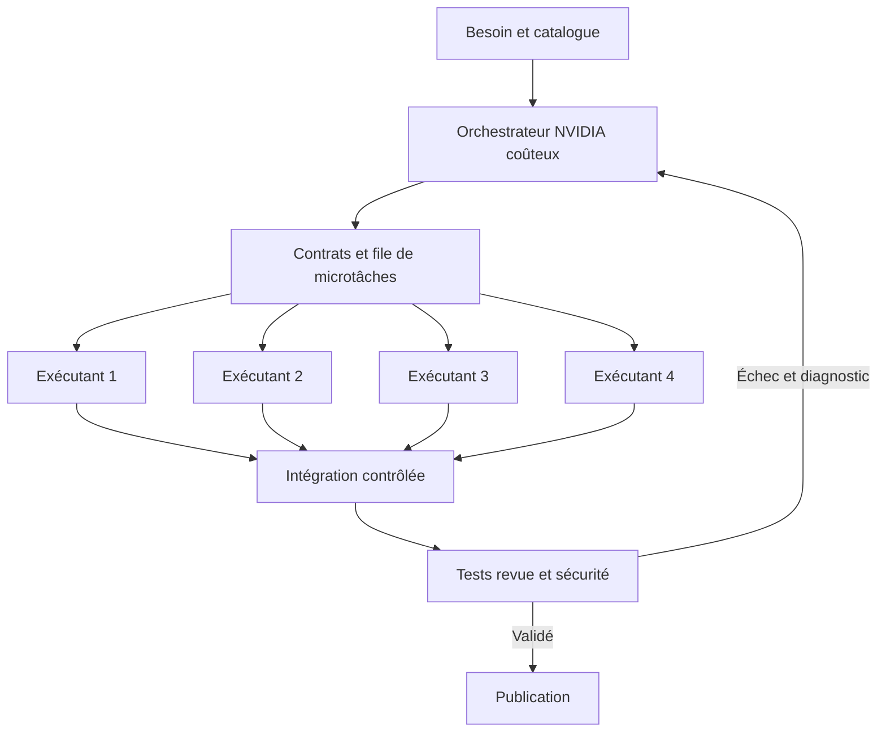

**Kyro est un IDE agentique qui construit, publie, maintient et fait évoluer des applications web à partir de l’intention du client.**

Depuis son ordinateur ou son téléphone, le client décrit le logiciel web souhaité. **Un orchestrateur utilisant le modèle NVIDIA le plus coûteux du catalogue retenu pilote une équipe extensible de sous-agents exécutants utilisant un modèle NVIDIA peu coûteux.** Le prototype démarre avec quatre exécutants de code, chacun affecté à une microtâche extrêmement bornée. L’orchestrateur décompose le besoin, attribue les tâches, suit leurs dépendances, contrôle les résultats et coordonne leur intégration. Le catalogue sémantique fournit les blocs réutilisables ; les exécutants les configurent et les composent exclusivement à partir de modèles validés. La revue et la sécurité complètent cette équipe.

Après publication, un agent utilisant le même modèle que l’orchestrateur assure la maintenance depuis le cloud, dans un service disponible 24 h/24. Une mémoire persistante conserve le contexte, les décisions et les incidents du projet. Le client peut demander des évolutions ou cliquer dans un canevas pour modifier directement l’interface, avec un aperçu immédiat. L’ambition est de lui demander très peu d’intervention sur l’ensemble du cycle de vie du logiciel.

Cette page décrit **l’idée du produit, son ambition, l’expérience utilisateur et le fonctionnement de l’équipe d’agents**. Elle développe les principes de [Premières notes](https://chatgpt.com/space/page_1ef5d98198008191831651e980886b2d) : préparer les opérations récurrentes, borner le travail des modèles et construire la fiabilité dans le système. L’objectif de quinze minutes jusqu’à une application utilisable reste une cible à mesurer.

Les choix d’implémentation sont regroupés dans l’[architecture technique](https://chatgpt.com/space/page_1869350b9e648191966bb8b7cff5b03b), leurs justifications dans le [journal de décisions](https://chatgpt.com/space/page_baca1e1d35e481919683b0dc23455045), et les capacités réutilisables dans le [catalogue des blocs](https://chatgpt.com/space/page_a34ccccf45d88191a9cf39578c465f43).

## Le problème et les premiers principes

Créer un logiciel exige de convertir une intention en règles précises, de relier données et comportements, de vérifier leurs interactions, puis d’exploiter et de faire évoluer le résultat. Notre système prend en charge cette chaîne. Le résultat recherché est une application utile dans la durée : chaque évolution doit préciser ce qui change et vérifier que les données, les règles métier et les choix du client non concernés sont préservés. L’utilisateur exprime le résultat souhaité et conserve la maîtrise des décisions métier sans devoir configurer un environnement de développement.

Quatre principes organisent le produit :

1. **Préparer les opérations répétitives.** Les fonctions communes deviennent des composants versionnés, documentés et testés.

2. **Décomposer la complexité en petites décisions contrôlables.** Chaque agent reçoit une tâche courte, le contexte utile et un résultat vérifiable. « Un millier de décisions simples » décrit la granularité recherchée, sans imposer mille appels : les opérations entièrement calculables sont confiées au code déterministe.

3. **Relier les propositions à une exécution contrôlée.** Les agents configurent et composent les blocs ; le code est généré à partir du catalogue validé ; le logiciel valide les paramètres, les contrats et les effets autorisés avant et pendant l’exécution.

4. **Conserver les preuves et le contexte dans la durée.** Les tests, les observations, les versions, les décisions et les incidents servent à vérifier les évolutions et à guider la maintenance.

La cible est une personne ou une organisation qui souhaite obtenir un logiciel web, y compris une application métier complexe, sans prendre en charge son développement et son exploitation. **L’ambition est une plateforme généraliste capable de construire et maintenir un très grand nombre d’applications grâce à sa bibliothèque de blocs.** Réservation, CRM, commerce, support, portails et outils internes illustrent cette diversité. Aucune restriction du prototype à une seule famille n’est retenue. Les développeurs conservent l’accès au code, aux outils et aux différences entre versions.

Une petite décision de modèle ne devient pas déterministe par sa seule simplicité. Notre objectif est de réduire la part incertaine, puis d’encadrer les propositions par des contrôles et des opérations déterministes. Les règles métier difficiles et les interactions entre composants doivent rester explicites.

## Le parcours depuis un ordinateur ou un téléphone

Le client demande, par exemple : « Crée un logiciel de réservation pour mes établissements, avec les disponibilités, les comptes clients et un espace pour les responsables. » Ce cas illustre le parcours ; l’ambition du produit couvre plusieurs familles de logiciels web.

1. Il décrit son besoin depuis son ordinateur ou son téléphone. Le texte, la voix, les photos et les captures font partie des modes d’entrée envisagés ; leur disponibilité sera indiquée dans les versions livrées.

2. L’orchestrateur présente ce que le client pourra réellement faire, les règles essentielles, les critères de réussite et le budget. Il vérifie d’abord la couverture par le catalogue ; une limite est expliquée en termes d’usage, avec une alternative réalisable lorsqu’elle existe, avant d’engager la construction. Il choisit des valeurs par défaut raisonnables et ne pose que les questions qui changent réellement le résultat.

3. L’orchestrateur distribue les microtâches aux quatre exécutants initiaux, puis renouvelle les attributions à mesure que les tâches sont validées. Les travaux indépendants avancent en parallèle dans des espaces isolés. Les exécutants configurent les blocs et instancient les connecteurs validés ; l’orchestrateur coordonne l’intégration pour produire un aperçu utilisable sur ordinateur et téléphone.

4. La revue, l’analyse de sécurité et les contrôles exécutables vérifient l’application assemblée. Le client voit les résultats et les blocages utiles ; il peut interrompre ou réorienter le travail.

5. Il essaie le logiciel et clique sur un élément du canevas pour modifier une couleur ou un texte, avec un aperçu immédiat. Une demande telle que « change les conditions d’annulation » déclenche une modification des règles métier et leurs vérifications.

6. Les agents publient dans le périmètre défini pour le projet. La surveillance et l’agent de maintenance prennent ensuite le relais, avec une mémoire persistante. Les évolutions et corrections suivent un processus traçable de validation et de publication.

L’interface propose trois vues principales : **la demande et les décisions**, **le canevas de l’application**, **son fonctionnement et les interventions des agents**. Une vue avancée donne accès aux fichiers, aux différences de code, aux tests et aux journaux. Le projet continue de fonctionner lorsque le client ferme son téléphone ou son navigateur.

## Les fonctions phares des IDE et des agents de code

Les références officielles consultées le 2 octobre 2026 établissent plusieurs bases : [Claude Code](https://code.claude.com/docs/en/overview) couvre les modifications de fichiers, les commandes, Git, MCP, la mémoire, les skills, les hooks et les sessions parallèles ; ses [sous-agents](https://code.claude.com/docs/en/sub-agents) disposent de contextes et d’outils distincts. [Codex Remote](https://developers.openai.com/blog/mastering-codex-remote-for-engineering) permet de diriger et de revoir du travail depuis le téléphone, avec des [worktrees](https://learn.chatgpt.com/docs/environments/git-worktrees) pour isoler les travaux. [Cursor](https://cursor.com/docs) documente la compréhension du dépôt, la planification et la revue ; son [agent navigateur](https://cursor.com/docs/agent/tools/browser) interagit avec l’application et observe console et réseau.

Le catalogue suivant rassemble les grandes familles de fonctions à couvrir dans notre produit cible. Leur intégration et leur priorité restent des choix de conception.

### Comprendre et modifier le projet

| Fonction à couvrir | Socle de développement | Notre système ajouté |
| --- | --- | --- |
| Compréhension du dépôt | Recherche de fichiers, symboles et dépendances | Carte des blocs, interfaces et comportements déjà validés |
| Contexte du projet | Instructions, fichiers, documentation, historique | Mémoire structurée des exigences et décisions acceptées |
| Planification | Découpage, dépendances et suivi des tâches | Contrat et critère de réussite pour chaque tâche |
| Édition du code | Éditeur, coloration, navigation, diagnostics | Accès avancé depuis mobile et ordinateur |
| Complétion et modifications ciblées | Suggestions, commandes en ligne, génération | Composition exclusive de primitives et modèles validés |
| Changements sur plusieurs fichiers | Fonctionnalités, refactorisation, migrations | Contrôle des interfaces et des zones de modification |
| Débogage | Reproduction, analyse des erreurs, correction | Retour d’exécution court adressé à l’agent responsable |
| Documentation | Explications, exemples et notes de version | Documentation liée aux composants réellement assemblés |
| Revue des changements | Différences, commentaires et acceptation | Résumé métier et preuves accessibles sur téléphone |

### Exécuter et livrer

| Fonction à couvrir | Socle de développement | Notre système ajouté |
| --- | --- | --- |
| Terminal et environnement | Commandes, dépendances, compilation, serveur | Environnement distant reproductible par projet |
| Tests et diagnostics | Tests, types, lint, contrôles de régression | Validation de la composition et des parcours métier |
| Navigateur piloté | Clics, formulaires, captures, console, réseau | Agent qui essaie l’application comme un utilisateur |
| Git et collaboration | Branches, commits, conflits, pull requests | Livraisons traçables et revue depuis mobile |
| Travaux parallèles | Sessions isolées et worktrees | Répartition selon les dépendances et les fichiers |
| Connexions externes | MCP, API, documentation et outils métier | Catalogue d’actions avec entrées et effets définis |
| Déploiement | Aperçus, configurations et publication | Vérification de l’adresse publiée et du parcours final |
| Exploitation | Journaux, erreurs, état du service | Diagnostic, correction et contrôle après déploiement |

### Personnaliser et garder le contrôle

| Fonction à couvrir | Socle de développement | Notre système ajouté |
| --- | --- | --- |
| Agents spécialisés | Rôles, contextes et outils distincts | Orchestrateur NVIDIA coûteux, quatre exécutants NVIDIA peu coûteux et extensibles, revue, sécurité et maintenance |
| Skills et commandes | Procédures réutilisables | Procédures pour composer et réparer nos primitives |
| Hooks et automatisations | Déclenchements sur événements ou horaires | Contrôles au passage de chaque étape autorisée |
| Sessions durables | Historique, reprise, tâches en arrière-plan | Mémoire du projet indépendante de la session et de la connexion du client |
| Instructions en cours de tâche | Réorientation et messages en attente | Replanification des tâches affectées |
| Permissions et isolation | Accès aux outils et environnements séparés | Autorisation de projet et limites par action |
| Points de reprise | Sauvegardes et retour à une version | Restauration du code et du déploiement, avec contrôle de compatibilité des données |
| Budget et visibilité | Consommation, durée et activité | Coût total par résultat validé et plafonds de reprises |
| Partage du projet | Revue et échanges entre collaborateurs | Décisions, aperçu et preuves dans une même interface |

Ce catalogue constitue le socle de fonctions à couvrir. Le premier prototype privilégie un parcours complet de création, de modification visuelle, de déploiement et de maintenance vérifiable.

## Notre système de primitives et de contrats

**Nous construirons et entretiendrons une grande bibliothèque de composants pour nos agents. Règle absolue du produit : les agents applicatifs ne codent jamais quoi que ce soit de zéro.** Toute application est construite par sélection, configuration et composition de composants, connecteurs, modèles de code et procédures déjà validés. La bibliothèque couvre authentification, organisations, permissions, données, fichiers, formulaires, recherche, tableaux de bord, paiements, notifications, traitements en arrière-plan, workflows et déploiement, ainsi que des assemblages métier réutilisables.

Le catalogue est classé de manière sémantique par capacité et par usage métier. L’agent recherche les blocs répondant à une intention et reçoit seulement les fiches pertinentes. Les ressemblances sémantiques proposent des candidats ; des contrats explicites déterminent leur compatibilité.

Chaque bloc décrit ce qu’il permet de faire, ses paramètres, ses limites, ses conditions d’utilisation et les autres blocs avec lesquels il peut être composé. Les blocs doivent être sécurisés par défaut et préserver les données et les droits de chaque client. La validation porte sur chaque bloc et sur le fonctionnement de l’application assemblée ; les contrats techniques sont détaillés dans la page d’architecture.

La demande devient une **spécification exécutable et versionnée** : écrans, données, relations, rôles, permissions, états, événements, règles métier et critères d’acceptation. Cette spécification contient aussi les choix visuels et constitue la référence commune de la conversation, du canevas et des agents. Le plan décrit comment la faire évoluer ; l’aperçu montre le résultat de la version en cours. Les agents proposent de petits changements ; un assembleur déterministe traduit les déclarations prises en charge en configuration, code et connexions.

Les exécutants configurent les blocs, les composent et instancient les connecteurs et modèles de code validés. Le code de liaison est généré par ces mécanismes ; il ne peut pas être inventé librement pour contourner une capacité manquante. Les règles métier doivent être exprimables avec les primitives et paramètres autorisés. Chaque élément livré reste rattaché à un composant et à une version du catalogue.

**Si une capacité manque, l’agent déclare un manque dans le catalogue et bloque la tâche concernée.** Il peut proposer une composition existante qui satisfait réellement le besoin, ou transmettre une demande d’enrichissement à l’équipe qui maintient la bibliothèque. Un nouveau composant suit un processus séparé de conception, revue, tests et publication avant de devenir utilisable par les agents applicatifs. Aucune extension improvisée n’est admise pendant la construction ou la maintenance d’une application. Le code généré et sa configuration restent consultables et exportables.

Le [catalogue cible](https://chatgpt.com/space/page_a34ccccf45d88191a9cf39578c465f43) rassemble **180 blocs en 18 familles** pour construire notamment réservation, CRM, support, portails, commerce, outils internes et applications documentaires. Il constitue une base à enrichir pour élargir la diversité des logiciels réalisables. La réservation est un exemple de composition ; elle ne définit ni une spécialisation du produit ni un plafond pour le prototype.

La complexité repose sur les interactions : autorisations côté serveur, contraintes transactionnelles, actions simultanées, événements reçus plusieurs fois, états persistants et migrations. La spécification doit les représenter ; les mécanismes d’exécution doivent les imposer. Pour le prototype, les nouveaux workflows peuvent adopter une nouvelle version tandis que ceux en cours conservent leur version, sauf migration explicite et vérifiée.

Une tâche d’agent précise :

- **L’entrée** : exigence, composants pertinents et état observé.

- **Le périmètre** : fichiers, outils et actions autorisés.

- **La sortie** : configuration, modification ou résultat structuré.

- **La preuve attendue** : compilation, test ou comportement observable.

- **La limite** : temps, tokens, tentatives et condition d’arrêt.

La validation porte sur les blocs et sur l’application assemblée : connexions, permissions, données, transitions, actions concurrentes et effets des migrations. Le code de liaison reste limité et contrôlé ; il ne constitue pas une voie de contournement des règles communes. Le coût de préparation et d’entretien du catalogue entre dans l’évaluation économique du produit.

## Les agents NVIDIA et leurs actions dans le monde numérique

NVIDIA publie des modèles Nemotron destinés aux usages agentiques, avec notamment des variantes Nano et Super. La [documentation officielle du dépôt Nemotron](https://github.com/NVIDIA-NeMo/Nemotron) fournit les références de modèles et des exemples de déploiement. La [documentation NVIDIA NIM sur les appels d’outils](https://docs.nvidia.com/nim/large-language-models/1.13.0/function-calling.html) décrit le mécanisme : le modèle produit un appel et ses arguments, puis le logiciel exécute l’opération et lui renvoie le résultat.

**Architecture imposée au prototype : un orchestrateur NVIDIA, quatre sous-agents exécutants de composition au départ, un agent de revue, un agent de sécurité et un agent de maintenance.** Quatre est l’effectif initial configurable, pas le plafond du produit. L’orchestrateur peut mobiliser davantage d’exécutants lorsque des tâches indépendantes sont disponibles, dans les limites de budget et de concurrence du projet.

| Rôle | Modèle attribué | Responsabilité |
| --- | --- | --- |
| Orchestrateur | Modèle NVIDIA le plus coûteux du catalogue retenu | Décomposer le besoin, fixer les contrats, attribuer les microtâches, gérer dépendances et budget, arbitrer les échecs et coordonner l’intégration |
| Exécutants 1 à 4 puis davantage selon le besoin | Modèle NVIDIA peu coûteux | Configurer ou composer une microtâche à partir du catalogue, livrer ses preuves et signaler les capacités manquantes |
| Agent de revue | Modèle NVIDIA peu coûteux, avec escalade vers l’orchestrateur | Examiner les changements face au contrat, chercher les cas limites et vérifier les tests |
| Agent de sécurité | Modèle NVIDIA peu coûteux, avec escalade vers l’orchestrateur | Examiner les permissions et interactions sensibles, vérifier les accès interdits et l’isolation |
| Agent de maintenance | Même modèle NVIDIA que l’orchestrateur | Diagnostiquer les incidents, déléguer les corrections aux exécutants et vérifier leur effet |

**La répartition économique est une exigence du produit : modèle NVIDIA le plus coûteux pour l’orchestration, modèle NVIDIA peu coûteux pour les exécutants.** Le modèle cher concentre les décisions globales et les arbitrages ; les exécutants à faible coût composent l’application et instancient le code du catalogue. Revue et sécurité disposent de contextes distincts et transmettent leurs incertitudes à l’orchestrateur. Le prix supérieur ne constitue pas une preuve de capacité : la qualité et l’économie de cette configuration doivent être mesurées.

Avant le benchmark, figer les identifiants et versions des modèles NVIDIA, le fournisseur, l’API, les paramètres et les tarifs datés. « Le plus coûteux » désigne le coût d’inférence le plus élevé parmi les modèles NVIDIA compatibles et accessibles du catalogue retenu, selon un profil entrée et sortie fixé à l’avance ; « peu coûteux » désigne le modèle exécutant choisi et son tarif documenté. Les noms précis restent à sélectionner. Un essai avec le même modèle partout peut servir d’ablation, mais ne remplace pas la configuration produit exigée.

### Un orchestrateur lui aussi strictement contraint

Le système doit fonctionner sans supposer que le modèle, même le plus coûteux, sait résoudre librement une tâche complexe. **L’orchestrateur est soumis aux mêmes exigences de simplicité, de périmètre et de preuve que les exécutants.** Son travail global est lui-même décomposé : identifier une exigence, retrouver des composants compatibles, vérifier une interface, établir une dépendance, attribuer une tâche ou examiner un résultat. Chaque appel traite une décision bornée avec une sortie structurée.

Le logiciel impose les états du travail : à préciser, planifié, prêt, en cours, à vérifier, validé ou bloqué. Il contrôle les transitions, les dépendances, les versions, les budgets et les preuves. L’orchestrateur choisit parmi les actions autorisées ; il ne peut ni créer librement une nouvelle procédure, ni contourner la bibliothèque, ni modifier les permissions ou les critères de réussite. L’ordonnancement calculable et les contrôles de cohérence sont exécutés par du code déterministe.

Une tâche ne devient prête que si elle possède un objectif local, des composants identifiés, des entrées et sorties définies, un périmètre autorisé et un critère de réussite exécutable. Elle indique aussi ce qui dépend de son résultat. Sinon, elle est précisée, redécoupée ou bloquée avec une raison explicite. Une tâche bornée reste utile à une application ambitieuse ; multiplier les appels sans simplifier une décision n’est pas un objectif.

### La boucle de travail de l’orchestrateur

1. Traduire la demande en critères d’acceptation, contrats d’interface et graphe de dépendances.

2. Décomposer récursivement le travail jusqu’à des microtâches simples : sélectionner une règle de validation existante, paramétrer un endpoint fourni, choisir un index pris en charge ou relier un bouton à une action du catalogue. Chaque tâche réalise une transformation locale avec un résultat vérifiable. Le découpage s’arrête dès que le contrat est assez simple pour être exécuté et vérifié localement. Les transformations entièrement calculables passent directement à l’assembleur, sans appel de modèle supplémentaire. Une tâche trop large est redécoupée ; une capacité absente est signalée.

3. Attribuer une seule microtâche active par exécutant, avec contexte utile, éléments de l’application autorisés, interfaces connues, résultat attendu, preuves et budget. Les quatre exécutants ne sont pas quatre départements permanents ; leurs attributions changent à chaque lot.

4. Exécuter en parallèle les tâches dont les changements sont réellement indépendants. Des espaces de travail séparés ne suffisent pas si deux tâches modifient la même règle métier ou dépendent du même état ; leur intégration est alors ordonnée.

5. Recevoir une proposition de configuration ou de composition, ses limites et ses preuves. L’assembleur produit les changements de code. Faire exécuter les vérifications, la revue et les contrôles de sécurité adaptés avant d’accepter le résultat. « Terminé » dans un message d’agent ne vaut pas validation.

6. En cas d’échec, transmettre le diagnostic utile, préciser ou réattribuer la tâche. Arrêter une répétition qui n’apporte aucun progrès, conserver les travaux compatibles et mettre à jour le plan. Les échanges, reprises et arbitrages restent bornés et comptabilisés.

L’effectif actif suit le nombre de tâches indépendantes prêtes et les budgets. Davantage d’exécutants doivent permettre davantage de travail utile en parallèle ; l’impact réel sur les tokens, le coût et la durée sera mesuré.

Chaque tâche possède un budget de tokens, de temps et de tentatives. Un échec remonte avec son diagnostic ; les reprises sont bornées. Les agents de revue et de sécurité ont des rôles distincts, mais peuvent partager des angles morts. Les contrôles obligatoires et les tests d’acceptation sont donc conservés indépendamment des propositions des constructeurs ; un agent ne peut pas rendre son travail valide en affaiblissant le critère qui échoue.

### Un mode plan adapté au système agentique

**Le mode plan est obligatoire avant la construction et avant toute évolution ou correction.** L’inspiration demandée est l’expérience de planification de Codex ; les règles suivantes définissent notre propre fonctionnement agentique.

Pendant ce mode, les agents peuvent lire le projet et le catalogue, analyser les dépendances et produire des documents de planification. Ils ne modifient ni le code applicatif, ni les données, ni les déploiements. Les exécutants peuvent recevoir des missions d’analyse en lecture seule pour vérifier une capacité ou une interface.

Le plan est un objet versionné contenant les exigences, les composants et leurs versions, les capacités manquantes, le graphe de microtâches, leurs contrats, les dépendances, les affectations prévues, les zones de modification, les budgets et les contrôles d’acceptation. Il distingue le travail parallèle du travail séquentiel et définit les conditions d’intégration, de publication et de récupération.

Avant exécution, le logiciel vérifie la couverture par la bibliothèque, la complétude des contrats, l’absence de cycles de dépendances et de conflits d’écriture, ainsi que la disponibilité des tests et du budget. L’utilisateur peut consulter et modifier le plan. Dans le périmètre déjà autorisé, un plan valide peut passer automatiquement à l’exécution ; une ambiguïté métier ou une action hors périmètre demande une décision. Un plan incomplet reste bloqué.

Un échec ou une nouvelle demande renvoie les seules tâches affectées au mode plan. L’orchestrateur conserve les résultats toujours compatibles, actualise les objectifs et relance les contrôles nécessaires. Une ancienne réponse ne doit pas écraser une retouche récente ni poursuivre une consigne annulée. Le plan partagé survit aux compactions et permet à l’utilisateur de voir ce qui reste valable.

### Les outils qui rendent les actions effectives

| Environnement | Opérations proposées par les agents | Preuve de l’effet |
| --- | --- | --- |
| Projet et catalogue | Lire, rechercher, proposer une composition autorisée | Version de départ et changements identifiés |
| Construction | Déclencher l’assemblage et les procédures de test prévues | Sources produites, résultat d’exécution et journaux |
| Navigateur de test | Observer et essayer les parcours de l’application | État de la page et résultats des interactions |
| Données et API de test | Appliquer les opérations du catalogue dans le périmètre prévu | Réponses et état effectivement observé |
| Hébergement | Demander un aperçu ou une publication contrôlée | Adresse accessible et version réellement servie |
| Services connectés | Proposer un appel à un connecteur configuré | Accusé et état confirmé, ou résultat inconnu signalé |

Les fonctions de ces outils restent exécutées par notre logiciel, avec validation des paramètres et contrôle du périmètre. Les modèles choisissent les actions et interprètent leurs résultats. Chaque action significative conserve un lien entre l’exigence, la modification et la preuve observée.

Cette boucle couvre la construction, les retouches du canevas, les évolutions métier et la maintenance. Chaque changement relie une intention, une version de départ, les éléments concernés, les comportements à préserver et les preuves attendues. Les vérifications sont adaptées à son impact ; le plan local d’une couleur reste automatique. Les publications sont ordonnées : si la version de départ a changé, le système réconcilie et revalide le changement avant promotion. Une réparation doit préserver les retouches du client sans embarquer les changements du brouillon encore non validés. L’utilisateur peut consulter les résultats sans avoir à coordonner lui-même l’équipe.

## Une autonomie définie à l’échelle du projet

L’utilisateur fixe une fois le périmètre du projet : espaces accessibles, services connectés, plafond de dépenses et mode de publication. Les agents exécutent ensuite les opérations prévues, avec des points de reprise et un journal consultable.

L’interface sollicite l’utilisateur seulement lorsqu’une décision change réellement le projet : règle métier ambiguë, achat ou dépense hors du périmètre défini, action irréversible sur les données. Les autorisations déjà accordées sont conservées. Depuis l’ordinateur ou le téléphone, il peut arrêter, reprendre, modifier sa demande et demander une restauration lorsque celle-ci est possible.

Les identifiants sensibles restent gérés par l’environnement d’exécution. Une restauration du déploiement doit tenir compte de la compatibilité des données et des migrations. Le produit doit rendre visible l’état réel de l’application et les limites d’une restauration. Un arrêt bloque les nouvelles actions concernées ; l’interface signale celles qui avaient déjà commencé et dont le résultat doit encore être confirmé. Elle distingue proposition, résultat vérifié, brouillon enregistré et version publiée.

## Maintenance continue depuis le cloud

Le service de maintenance doit rester disponible 24 h/24, même lorsque le client est déconnecté. Il utilise un agent du même modèle que l’orchestrateur, avec une surveillance continue des erreurs, des traitements, de la disponibilité et des retours utilisateurs. Dans l’esprit de la présence continue évoquée avec Dots, le projet reste suivi dans le cloud. Le modèle est sollicité lorsqu’un diagnostic ou une action est utile, plutôt que de générer des tokens sans interruption.

**L’orchestrateur de maintenance ne modifie JAMAIS la production avant d’avoir essayé et validé le changement hors production.** Cette règle couvre code, configuration, composants, migrations et données ; l’urgence et le budget ne permettent aucun contournement.

1. Observer la production en lecture seule et rattacher le bug à la version concernée.

2. Reproduire le défaut hors production, sur un environnement représentatif avec données synthétiques ou désensibilisées. Si la reproduction ou la validation nécessaire manque, la correction reste bloquée.

3. Passer par le mode plan, puis déléguer une correction bornée utilisant exclusivement la bibliothèque validée.

4. Essayer la correction hors production et exécuter obligatoirement les tests ciblés, les tests de régression et les tests d’intégration, ainsi que la revue et les contrôles de sécurité applicables. Conserver les résultats et la version testée.

5. Autoriser la promotion uniquement si tous les contrôles requis réussissent. Déployer exactement l’artefact validé, avec la configuration et les migrations contrôlées. Tout changement ultérieur invalide la validation concernée et déclenche de nouveaux tests hors production.

6. Vérifier le résultat après publication. En cas d’échec, utiliser uniquement une procédure de récupération prévalidée et compatible avec les données ; toute nouvelle correction repasse par le même circuit.

Le verrou est imposé par le logiciel : les agents n’ont pas d’accès direct en écriture à la production. Seul le service de déploiement peut promouvoir une version avec un dossier de validation complet, dans les autorisations du projet. Aucun agent ne peut désactiver les tests, modifier leurs critères pour passer ou s’accorder une dérogation.

Le but est de corriger rapidement les défauts traitables avec très peu d’intervention du client. Les corrections validées entrent dans la politique du projet ; une ambiguïté métier ou un changement hors de ce périmètre remonte avec une proposition concrète. Une détection en continu ne garantit pas la découverte de tous les bugs ni une réparation immédiate. Les délais, faux diagnostics, échecs et effets secondaires doivent être mesurés.

Le retour à une version de code ne suffit pas à annuler une migration de données ou un effet externe. La maintenance doit vérifier cette compatibilité et prévoir la récupération adaptée. L’utilisateur doit pouvoir suivre l’incident, la correction et son résultat sans devenir l’opérateur technique du logiciel.

## Mémoire persistante du projet

Dans l’esprit de la mémoire persistante évoquée avec Hermes, les agents doivent retrouver le contexte utile après une interruption, une nouvelle session ou un incident. Nous conservons les exigences, les décisions acceptées, les préférences visuelles, les versions, les déploiements, les tests, les incidents, les diagnostics et les corrections confirmées.

La spécification fait référence pour le comportement souhaité ; le dépôt conserve le code généré et ses versions ; le déploiement identifie la version effectivement en ligne. Chaque version publiée relie la spécification, les versions des composants, l’artefact déployé et ses preuves de validation. La mémoire conserve les raisons des choix et l’historique des interventions, avec date, source, version et statut. Elle peut retrouver une procédure qui a fonctionné, mais doit vérifier qu’elle reste applicable. Un index sémantique facilite cette recherche sans remplacer les références exactes.

Les hypothèses restent distinctes des faits vérifiés. La mémoire est isolée par projet et par client ; les secrets sont gérés séparément. Les journaux et contenus utilisateurs restent des observations, pas des instructions autorisant une intervention. Le prototype doit montrer une reprise effective après redémarrage, avec les décisions et l’incident retrouvés.

### Compaction automatique du contexte de chaque agent

**La compaction automatique est obligatoire pour l’orchestrateur, les exécutants, la revue, la sécurité et la maintenance.** L’inspiration demandée est une expérience de continuité de travail comparable à celle de Codex ; cette spécification ne suppose pas de reproduire son implémentation interne.

Le logiciel suit l’occupation de la fenêtre de contexte de chaque modèle. Avant un seuil configurable, avec une réserve pour la réponse et les retours d’outils, il sauvegarde un point de reprise puis remplace l’historique actif volumineux par un résumé structuré et les références utiles. Le seuil dépend de la fenêtre du modèle et doit être fixé et testé avant le benchmark. Une tâche isolée trop grande est redécoupée ; la compaction ne sert pas à masquer un périmètre excessif.

Le point de reprise conserve obligatoirement : l’objectif actuel ; les instructions et interdictions en vigueur ; la version du plan ; les identifiants et états des tâches ; les contrats ; les versions de code et de composants ; les décisions acceptées ; les faits et hypothèses séparés ; les erreurs non résolues ; les tests et leurs preuves ; les budgets restants ; les opérations en cours et les prochaines actions autorisées. Les règles de production et d’usage exclusif du catalogue sont réinjectées depuis la configuration de référence, sans dépendre d’un résumé généré.

Les journaux complets et les artefacts restent persistants et consultables. Le résumé sert d’index de travail, sans remplacer le dépôt, le plan ou les preuves. Le logiciel vérifie les champs obligatoires et la cohérence avec l’état enregistré. Si une information critique manque ou contredit la source, il la recharge et bloque l’action dépendante jusqu’à résolution. Une action au résultat inconnu doit être réconciliée avec l’état réel avant toute répétition.

L’orchestrateur conserve une synthèse globale des statuts ; chaque exécutant recharge seulement son contrat et ses dépendances. Le benchmark comptabilise le coût et les tokens de compaction, les relectures, les pertes d’information observées et la réussite des reprises. La démonstration doit provoquer une compaction pour vérifier qu’aucune contrainte, décision ou preuve n’est perdue.

Dots et Hermes sont ici des inspirations fonctionnelles citées par Augustin, respectivement pour le suivi continu et la mémoire ; nous ne supposons pas une reprise de leur architecture interne.

## Canevas pour modifier directement le logiciel

L’utilisateur peut cliquer sur un élément de l’application, depuis son ordinateur ou son téléphone, puis modifier une couleur, un texte, un espacement ou une autre propriété prise en charge. Le canevas fournit un aperçu immédiat et une annulation possible. Les ajustements visuels simples utilisent directement des propriétés structurées et des variables de design ; ils ne nécessitent pas systématiquement un appel au modèle.

Chaque modification est enregistrée dans la représentation versionnée de l’interface et dans les préférences pertinentes du projet. Elle doit survivre à la prochaine reconstruction ou correction. Le canevas et les agents travaillent donc sur le même état de référence, afin de ne pas écraser les choix du client.

Les changements de parcours, de données ou de permissions passent par la même construction contrôlée que les autres évolutions. L’aperçu peut être immédiat ; la publication applique les vérifications adaptées au changement. Le produit doit rendre cette distinction compréhensible sans exposer sa complexité technique à chaque ajustement.

## Design et expérience utilisateur

**Le client doit pouvoir se concentrer entièrement sur ce qu’il veut créer. Il ne doit jamais avoir à deviner comment utiliser l’outil.** L’ambition est une interface aussi évidente que soignée, directement inspirée d’Apple, d’OpenAI et de Codex : des actions faciles à trouver, un résultat visible, une réponse rapide et la liberté de revenir en arrière. « Ne jamais frustrer » est notre exigence de conception ; nous la confrontons à des essais avec des utilisateurs, y compris débutants.

Les règles ci-dessous précisent le canevas décrit plus haut. Elles définissent l’expérience à construire ; elles ne décrivent pas des fonctions déjà livrées.

### Les principes retenus chez Apple et OpenAI

Les sources primaires suivantes ont été croisées le 2 octobre 2026. La dernière colonne présente **nos choix de conception**, déduits de ces références.

| Référence | Principe documenté | Application à notre produit |
| --- | --- | --- |
| [Steve Jobs, conférence d’Aspen en 1983 et propos sur le Macintosh](https://book.stevejobsarchive.com/) | Rendre l’ordinateur facile à apprendre et à utiliser, avec une attention commune au logiciel, à l’objet et à l’interaction. | Partir du geste attendu : demander, voir, modifier, essayer. Le client n’a pas à apprendre les commandes du développement. |
| [Jony Ive, présentation d’iOS 7 en 2013](https://www.apple.com/newsroom/2013/06/10Apple-Unveils-iOS-7/) | La simplicité consiste à mettre de l’ordre dans la complexité ; la cohérence doit s’étendre à tout le système. | Les mêmes gestes, mots et contrôles fonctionnent partout. Chaque option apparaît au moment où elle devient utile. |
| [Apple, Design foundations from idea to interface, WWDC25](https://developer.apple.com/videos/play/wwdc2025/359/) | L’écran doit rendre évidents la position de l’utilisateur, les actions possibles et la suite du parcours. | Un projet clairement nommé, une action principale par contexte et des libellés explicites. Les commandes utiles restent repérables. |
| [OpenAI, Design Guidelines](https://openai.com/brand/) | L’identité visuelle associe chaleur humaine et précision technique. | Une direction visuelle calme, une typographie lisible et une personnalité accueillante, avec une identité propre au produit. |
| [OpenAI, présentation de l’application Codex du 2 février 2026](https://openai.com/index/introducing-the-codex-app/) | Le travail est organisé par projets et fils ; les changements peuvent être revus dans leur contexte. Le lancement présente aussi un ton conversationnel et empathique. | Garder demande, résultat et corrections proches ; rendre l’activité des agents consultable ; proposer un assistant amical et concis. |

### Un poste de travail centré sur le résultat

**Sur ordinateur, la conversation occupe la partie gauche et l’application en cours de création la partie droite, avec la plus grande surface donnée à l’aperçu.** La séparation est redimensionnable ; l’aperçu peut occuper tout l’espace. Une barre supérieure rassemble le nom du projet, son état, l’historique et la publication.

- **À gauche : demander et décider.** Une conversation simple, un résumé du travail en cours et les seules questions qui changent réellement le résultat. Le plan détaillé se déplie à la demande.

- **À droite : essayer et modifier.** L’application fonctionne dans un navigateur intégré relié à son environnement de développement. Deux commandes visibles, « Tester » et « Modifier », distinguent un clic qui utilise l’application d’un clic qui sélectionne un élément.

- **Au-dessus de l’aperçu : choisir l’écran.** « Ordinateur », « Tablette » et « Mobile » changent le format en un clic. La page ouverte et les saisies sont conservées lorsque le changement de format le permet.

- **Sur téléphone : une vue à la fois.** « Conversation », « Aperçu » et « Activité » restent directement accessibles. Les réglages d’un élément s’ouvrent dans un panneau adapté au pouce.

Les fichiers, le terminal, les tests et les journaux restent disponibles dans les détails avancés. Une personne doit pouvoir créer et personnaliser son application sans les ouvrir.

### Modifier directement et voir immédiatement

| Intention | Geste proposé | Résultat attendu |
| --- | --- | --- |
| Changer une couleur | Sélectionner l’élément, puis choisir une couleur dans un petit nuancier. | Le résultat apparaît pendant le choix. « Cet élément » est le périmètre par défaut ; « Tout le thème » est une option explicite. |
| Corriger un texte | Sélectionner le texte et saisir son remplacement. | Le texte change dans son contexte, sans devoir formuler un prompt. |
| Ajuster taille ou espacement | Utiliser les contrôles simples associés à l’élément. | Des valeurs cohérentes sont proposées ; une valeur précise reste accessible. |
| Demander une modification complexe | Sélectionner l’élément puis écrire, par exemple, « ajoute un choix de date ». | La demande inclut automatiquement l’élément et la page concernés. |
| Revenir en arrière | Cliquer sur « Annuler » ou ouvrir l’historique. | Le changement visuel précédent est rétabli ; une restauration plus large en indique clairement la portée. |

Les réglages directs utilisent les propriétés structurées du catalogue et ne déclenchent pas systématiquement un modèle. **Le mode plan reste obligatoire : un ajustement pris en charge produit un plan local validé automatiquement dans le périmètre autorisé.** Pendant ce contrôle, l’aperçu peut afficher une prévisualisation provisoire. L’interface distingue ensuite « Enregistrement en cours », « Enregistré » et un éventuel échec. Une couleur choisie ou un texte corrigé doit survivre à la reconstruction, à une correction des agents et à la réouverture du projet.

Si un agent travaille sur l’élément que le client vient de modifier, le système conserve le choix récent du client et réconcilie les changements. Il ne l’écrase jamais silencieusement. Une demande de décision apparaît seulement si deux intentions sont réellement incompatibles.

### Tester une véritable application en temps réel

L’aperçu doit permettre de naviguer, remplir des formulaires et essayer les parcours avec des données de test. Le serveur démarre et se remet à jour automatiquement. Les modifications visuelles simples apparaissent immédiatement ; les changements qui exigent une reconstruction affichent leur état réel. « Préparation de l’aperçu », « Mise à jour » ou « Aperçu indisponible » remplacent une attente incompréhensible.

Le passage au mobile ajuste la largeur de l’aperçu ; il ne prouve pas à lui seul le bon fonctionnement sur un véritable téléphone. Un lien d’aperçu, puis un QR code, permettent aussi d’ouvrir l’application sur son appareil. Les essais sont isolés de la production et n’envoient pas de vrais paiements ou messages par inadvertance.

**« Enregistré » signifie conservé dans le projet ; « Publié » signifie accessible aux utilisateurs de l’application.** Le projet conserve séparément le brouillon et la version en ligne. L’interface indique quelle version est affichée et si des changements enregistrés attendent encore leur publication ; un échec de préparation conserve le brouillon et la version déjà en ligne. La publication suit les contrôles et le mode de publication déjà autorisés pour le projet.

### Une finition visuelle cohérente et accessible

Direction proposée : surfaces neutres, espaces généreux, typographie nette, alignements précis, séparateurs discrets et couleur d’accent utilisée avec retenue. La qualité doit se voir jusque dans les champs, les menus, les états vides, les erreurs et les transitions. Les animations servent à comprendre un changement et respectent la réduction des mouvements.

Un petit système de design partagé définit couleurs, textes, espacements, arrondis et états des composants. Les thèmes clair et sombre gardent une lisibilité comparable. Les actions essentielles ont un libellé ; elles ne dépendent ni d’un survol ni d’une icône à deviner. Navigation au clavier, focus visible, lecteurs d’écran, zoom et commandes tactiles font partie du parcours normal. Une couleur de thème peu lisible déclenche une proposition de contraste corrigé.

### Des agents attachants et un assistant amical

L’assistant principal reste l’interlocuteur du client. L’équipe est consultable dans « Activité », avec des noms courts et amusants : **Pixel, Moka, Kiwi et Biscotte** pour les quatre exécutants initiaux. Les noms restent stables ; la tâche affichée change selon l’attribution réelle. Exemple : « Moka · ajuste le formulaire » ou « Kiwi · attend la validation ». Ces noms ne créent pas quatre départements permanents.

L’activité montre ce qui avance, ce qui bloque et ce qui demande une décision. En cas de blocage, l’assistant précise l’effet concret sur le résultat et la prochaine action utile, en distinguant ce qu’il prend en charge de ce qui exige le choix du client. L’activité peut être repliée. L’utilisateur n’a pas à choisir quel sous-agent contacter. Les progrès affichés correspondent à des événements observés ; nous évitons les pourcentages inventés, les conversations internes interminables et les animations qui simulent du travail.

Le ton par défaut est **amical, calme et direct**, avec une chaleur légère et sans infantilisation. L’assistant nomme le résultat, indique la suite et reconnaît clairement une limite. Il ne félicite pas chaque clic et n’accuse jamais l’utilisateur.

- Pendant le travail : « Je prépare l’aperçu. Tu pourras essayer le formulaire dès qu’il sera prêt. »

- Après un changement confirmé : « La couleur est mise à jour et enregistrée. Tu peux l’annuler ici. »

- En cas de problème : « L’aperçu n’a pas redémarré. Tes modifications sont conservées ; je vérifie ce qui bloque. »

- Si une décision manque : « Les réservations doivent-elles être confirmées automatiquement ou après ton accord ? »

### Vérifier la simplicité avec des utilisateurs

**Cibles initiales proposées, à mesurer et non encore atteintes :** une personne découvrant le produit doit trouver comment changer une couleur en moins de 30 secondes, passer au mobile en un clic et annuler un changement en moins de 5 secondes. Le retour visuel d’un réglage local vise moins de 100 ms au 95e percentile, une fois l’aperçu chargé ; ce budget ne décrit ni la durée d’un appel au modèle ni celle d’une reconstruction.

Faire essayer sans tutoriel le même parcours à cinq personnes non techniques : modifier une couleur et un texte, tester un formulaire, passer au mobile, annuler et retrouver une modification après réouverture. Relever les hésitations, erreurs, demandes d’aide et temps par tâche ; leur demander ensuite ce qui est enregistré et ce qui est publié. Chaque difficulté observée devient un point de conception à corriger. Cet essai exploratoire ne suffit pas à établir l’accessibilité ni une absence universelle de frustration.

### Maquette interactive du poste de travail

Cette maquette illustre la disposition et les gestes proposés. On peut changer le format d’écran, modifier la couleur et le texte du bouton, tester une réservation fictive, annuler et consulter l’équipe. Elle ne contient ni serveur de développement ni agents réels ; elle sert à examiner l’expérience avant sa construction.

## La question scientifique

> **Pour la même application web et les mêmes critères d’acceptation, notre processus avec un orchestrateur NVIDIA coûteux, au moins quatre exécutants NVIDIA peu coûteux et des primitives réutilisables réduit-il les tokens et le coût total par rapport à une construction de zéro avec Codex, tout en livrant un résultat validé de qualité comparable ?**

Cette question reprend les principes de Premières notes. La réutilisation doit réduire les décisions à réinventer ; la décomposition doit rendre les décisions restantes plus simples ; la mémoire et l’observation du logiciel doivent guider les reprises. Le coût du modèle plus capable est concentré sur les décisions globales et les incidents qui le nécessitent.

L’hypothèse est que les gains de composition et de spécialisation compensent les frais de coordination. Elle peut être mise en défaut si les agents se trompent dans l’assemblage, si les reprises absorbent l’économie attendue ou si les besoins spécifiques dépassent régulièrement la bibliothèque.

### Benchmark obligatoire face à Codex

**Périmètre expérimental à définir :** sélectionner des briefs qui permettent d’évaluer la diversité des applications réalisables et la réutilisation des blocs. Réservation, CRM, support ou portail documentaire sont des exemples possibles ; la campagne n’est pas prédéterminée autour d’une seule verticale. Pour chaque brief, les deux configurations comparées conservent les mêmes exigences, conditions d’exécution et critères de validation.

| Configuration principale | Départ | Organisation |
| --- | --- | --- |
| Codex de zéro | Dépôt vide, sans notre catalogue préparé | Codex construit l’application avec son fonctionnement habituel documenté ; modèle, version, paramètres et outils sont figés |
| Notre processus | Dépôt applicatif vide, avec accès à notre catalogue versionné | Orchestrateur NVIDIA le plus coûteux du catalogue retenu, quatre exécutants NVIDIA peu coûteux au départ, revue, sécurité et intégration contrôlée |

**Cette comparaison est un livrable obligatoire du prototype.** Les deux configurations reçoivent exactement le même brief, les mêmes exigences fonctionnelles et visuelles, les mêmes données initiales et les mêmes critères d’acceptation. Elles utilisent le même framework, un environnement et des outils équivalents, ainsi que les mêmes plafonds de temps et de dépenses fixés avant l’essai. Aucune ne reçoit le code ni les résultats de l’autre. Toute intervention humaine est enregistrée, avec les mêmes règles d’assistance. Les tests finaux sont indépendants et identiques. Notre accès au catalogue est un avantage explicite du produit dont la préparation est comptabilisée séparément ; la comparaison mesure le système complet.

Les ablations viennent après le duel principal pour comprendre les gains : petit modèle seul avec et sans catalogue ; équipe avec et sans catalogue ; même modèle dans tous les rôles ; mêmes modèles et blocs avec deux, quatre puis huit exécutants ; mêmes blocs avec et sans assembleur contrôlé. Elles distinguent les effets de la réutilisation, de l’orchestration, du nombre d’exécutants et de l’affectation des modèles. Les essais de maintenance partent des mêmes versions et incidents injectés ; ceux portant sur la mémoire incluent une interruption et une reprise de session. Les variantes expérimentales restent dans un environnement isolé ; elles n’affaiblissent jamais les permissions, les contrôles finaux ou les règles de publication. Pour isoler l’effet du parallélisme, publier à la fois la qualité au même plafond de dépenses et le coût pour atteindre les mêmes critères.

Le benchmark combine des besoins couverts par les composants et des compositions métier inédites, sans autoriser de code écrit de zéro par nos agents. Le catalogue est figé avant la révélation des briefs. Les demandes hors couverture sont comptées comme blocages ou échecs, sans suppression du dénominateur ni ajout de composants pendant l’essai. Chaque tâche inclut une création et une modification ; un lot dédié ajoute un incident contrôlé, sa correction hors production et une reprise après compaction.

### Mesurer un résultat utilisable

Le critère principal est la **proportion d’applications qui passent tous les parcours fonctionnels et contrôles critiques prédéfinis après déploiement**. Les tests cachés sont écrits indépendamment de l’agent constructeur.

Pour chaque construction, enregistrer depuis le brief jusqu’à la validation finale :

- **les tokens d’entrée et de sortie, les tokens en cache et les tokens de raisonnement lorsqu’ils sont exposés**, ventilés par modèle, rôle et tentative, puis totalisés sans double comptage ; inclure mode plan, orchestration, exécution, revue, sécurité, compactions du contexte, messages de coordination et corrections. Signaler les catégories non observables. Des tokeniseurs différents limitent l’interprétation d’un simple total ; les tokens et le coût sont présentés séparément ;

- **le coût total par application**, ventilé entre orchestrateur, exécutants, revue, sécurité, corrections, outils et infrastructure ;

- le temps jusqu’au premier aperçu, puis jusqu’au déploiement validé ;

- le nombre d’interventions humaines nécessaires ;

- les erreurs de droits d’accès, de données et de règles métier ;

- la réussite des modifications, la persistance des choix visuels et les régressions introduites ;

- les délais de détection et de correction des incidents, les faux diagnostics, les corrections infructueuses et les retours arrière nécessaires ;

- la capacité à retrouver les décisions et l’état pertinent après une interruption de l’agent. Mesurer aussi le travail dupliqué, les conflits entre agents, les résultats devenus obsolètes et les faux succès, afin d’expliquer les échecs au-delà d’un score global.

Le minimum de démonstration est **une même application obtenue par deux constructions indépendantes, Codex codant de zéro et notre processus composant sa bibliothèque**, une fois avec Codex et une fois avec notre processus, avec journaux complets, résultats des mêmes tests et tableau comparatif. Ce duel est obligatoire mais ne suffit pas à généraliser. La campagne exploratoire proposée porte ensuite sur **20 briefs avec trois répétitions par brief et par configuration principale**. Les comparaisons sont appariées par brief ; les répétitions sont regroupées dans l’analyse. Une étude de non-infériorité nécessitera une marge définie à l’avance et un nombre de briefs adapté. Séparer les cas servant à régler les agents des briefs finaux ; conserver tous les essais, afficher la dispersion et éviter de conclure à partir de la meilleure exécution seule.

**Comptabilité obligatoire.** Le coût total d’une construction additionne tous les appels de modèles, les corrections, outils et infrastructures consommés. Publier les tarifs datés, la devise et les montants avant crédits promotionnels ; distinguer dépenses réelles et estimations. Si Codex est utilisé via un abonnement sans coût marginal observable, ne pas assimiler l’abonnement au coût d’une application : utiliser une mesure facturée disponible ou afficher séparément une estimation documentée. La préparation et l’entretien du catalogue sont publiés séparément, puis amortis selon plusieurs volumes. Présenter le coût par application tentée et le coût total de la campagne divisé par le nombre d’applications validées ; si aucune ne passe, ce dernier indicateur n’est pas calculable. Création et maintenance restent séparées.

**Règle de conclusion.** Pour un résultat qui passe les mêmes contrôles, publier l’économie de coût en pourcentage : 100 × (coût Codex − coût de notre processus) / coût Codex. Calculer séparément la variation des tokens. Ne revendiquer une baisse des deux que si les deux mesures la montrent. Une application incomplète moins chère n’établit pas l’efficacité ; afficher aussi les échecs, reprises et interventions. Le benchmark doit permettre de démontrer un gain s’il existe, sans le présupposer.

### Résultats à publier pour chaque application

| Mesure | Codex de zéro | Notre processus |
| --- | --- | --- |
| Modèles et versions | À renseigner | À renseigner par rôle |
| Effectif et concurrence maximale | À mesurer | À mesurer |
| Critères d’acceptation réussis sur le total | À mesurer | À mesurer |
| Tokens d’entrée et de sortie | À mesurer | À mesurer pour tous les agents |
| Cache et raisonnement exposés | À mesurer | À mesurer |
| Coût des modèles | À mesurer | À mesurer pour tous les agents |
| Coût des outils et de l’infrastructure | À mesurer | À mesurer |
| Coût total avant crédits | À mesurer | À mesurer |
| Durée jusqu’au résultat validé | À mesurer | À mesurer |
| Reprises et interventions humaines | À mesurer | À mesurer |
| Préparation du catalogue et amortissement | Sans notre catalogue | À publier séparément |

Aucun résultat n’est encore établi. Conserver les traces d’exécution, la version du code livré et le rapport des tests pour permettre la vérification du comparatif.

## Démontrer l’ambition du produit au hackathon

Le démonstrateur doit rendre visible la capacité à **construire, publier, maintenir et faire évoluer des applications variées à partir de la même bibliothèque**. Les scénarios précis restent à choisir ; aucune décision de limiter le prototype à la réservation n’est actée. Une application de réservation pour plusieurs établissements reste un exemple utile pour illustrer la continuité entre création, modification métier, personnalisation et maintenance.

Le prototype réunit :

- une interface sur ordinateur et téléphone pour demander, suivre, essayer et modifier visuellement ;

- un catalogue étendu de blocs réutilisables pour les comptes, permissions, organisations, données, interfaces, workflows, recherche, communications et fonctions métier de plusieurs familles d’applications ;

- un orchestrateur utilisant le modèle NVIDIA le plus coûteux du catalogue retenu, quatre exécutants de code NVIDIA peu coûteux avec effectif extensible, un agent de revue, un agent de sécurité et un agent de maintenance utilisant le même modèle que l’orchestrateur ;

- un espace de code distant, un terminal, un navigateur et des outils de données ;

- une boucle de tests fonctionnels et de sécurité sur les blocs, les connexions et le résultat assemblé ;

- un aperçu, une publication, une surveillance continue et des corrections obligatoirement essayées et validées hors production avant promotion ;

- une mémoire persistante du projet avec compaction automatique du contexte, un mode plan agentique, un canevas modifiable et une instrumentation des tokens, du temps, des appels et des coûts par agent et par construction ;

**Exemple de séquence de démonstration pour une application de réservation :** les six étapes ci-dessous montrent le cycle de vie complet d’une même application, avec ses données persistantes. Une réservation existante doit rester cohérente avec la règle retenue, les permissions effectives et la personnalisation conservée. Ce scénario illustre le fonctionnement du produit ; il ne constitue pas une limite au nombre ou aux familles d’applications du démonstrateur.

1. Le client décrit son logiciel ; le mode plan vérifie sa couverture par la bibliothèque, décompose le travail et expose les tâches. Les agents exécutent le plan avec les blocs validés puis publient une application utilisable.

2. Les essais vérifient l’isolation entre établissements, les permissions, la persistance et le comportement de deux demandes simultanées sur la dernière place.

3. Le client change une règle de disponibilité ; le système montre les changements et le traitement des réservations existantes, puis reteste.

4. Il clique dans le canevas et change une couleur. Ce choix subsiste après reconstruction.

5. Un défaut contrôlé est introduit dans l’environnement de démonstration. La maintenance le reproduit hors production, compose une correction et fait réussir tests ciblés, régression et intégration. La démonstration montre le refus de déployer sans ces preuves, puis la promotion de la version validée.

6. Une compaction automatique est déclenchée, puis une session redémarre. L’agent reprend la tâche avec le plan, les contraintes, la version et les preuves préservés, sans rejouer une action déjà exécutée.

La démonstration affiche les blocs et versions réutilisés, le code généré et sa provenance dans le catalogue, les changements métier et les tests réellement exécutés. **Elle doit inclure le comparatif Codex de zéro contre notre processus**, avec le nombre d’exécutants effectivement actifs, les tokens par rôle, le coût complet et les corrections. Les simulations éventuelles sont identifiées. Les nombres de lignes ou de tests ne remplacent pas la vérification des comportements.

Le catalogue étendu, la voix, l’import visuel, les paiements, les domaines personnalisés et la collaboration avancée font partie de l’ambition du produit. Leur ordre de réalisation et le contenu exact de la démonstration restent à définir ; cette page n’acte pas leur report après le hackathon. Les capacités présentées comme réalisées doivent fonctionner effectivement, y compris dans leurs interactions.

## Le positionnement du projet

Le mobile est un moyen d’accès. La création par conversation, le backend intégré et les tests sont déjà documentés par [Lovable](https://docs.lovable.dev/features/cloud) et ses [outils de vérification](https://docs.lovable.dev/features/testing). Les [primitives typées d’Encore](https://encore.dev/docs/ts) montrent aussi que réutilisation et agents ne constituent pas, seuls, une nouveauté.

Notre différenciation proposée est **la construction et l’exploitation continue d’un logiciel décrit explicitement, composé exclusivement à partir d’une bibliothèque de composants validés**, avec une équipe aux tâches bornées et une mémoire liée aux versions. Le client doit constater un effet : moins de travail demandé, moins de régressions, des incidents traités et un coût maîtrisé.

Nous devons donc montrer une évolution sur des données existantes, un accès interdit refusé, une correction après incident et une préférence visuelle conservée. L’originalité et l’avantage face aux produits comparables restent à établir par ces résultats ; changer le vocabulaire ou afficher davantage d’agents ne suffit pas.

**Pitch proposé :** « Décrivez le logiciel web dont vous avez besoin. Notre équipe d’agents compose des blocs réutilisables, configure vos règles métier avec les composants disponibles et publie l’application. Elle conserve la mémoire de votre projet pour la surveiller, la corriger et la faire évoluer. Vous pilotez le résultat et personnalisez son interface depuis votre ordinateur ou votre téléphone. »

Avant les essais, nous devons fixer les modèles et l’API compatibles avec le règlement, le noyau de blocs, les contrats et les scénarios de validation. Les premiers résultats détermineront si le coût de coordination et de maintenance reste compatible avec le pari économique de Premières notes.

L’architecture et l’expérience visées viennent de la proposition d’Augustin : un orchestrateur utilisant le modèle NVIDIA le plus coûteux du catalogue retenu, quatre exécutants NVIDIA peu coûteux au départ et un effectif extensible, des microtâches extrêmement bornées, revue, sécurité, catalogue sémantique, maintenance 24 h/24, mémoire persistante et canevas. Le benchmark obligatoire face à Codex doit mesurer l’avantage économique et les tokens nécessaires à un résultat validé.

